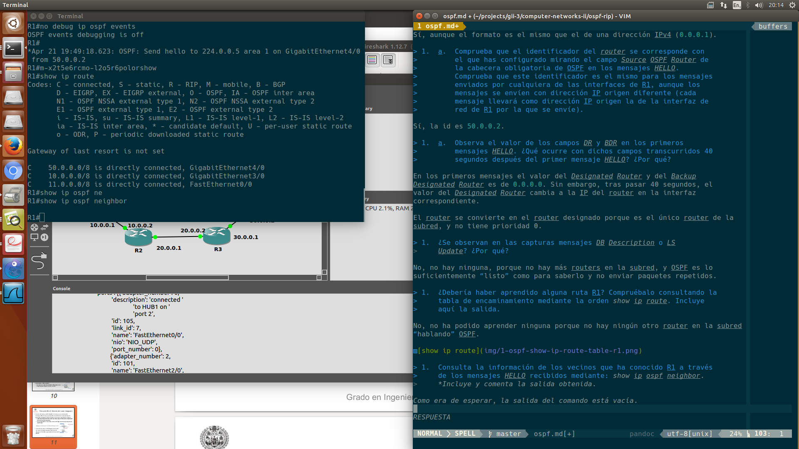
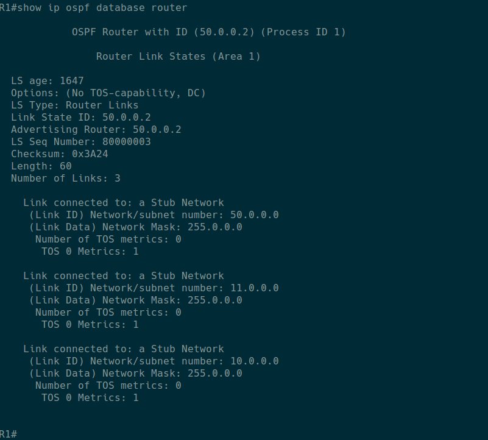

# Introducción

> En el fichero *RIPOSPF.rar* está definida una red como la que se muestra
> en la [Figura 1](#anchor-1). Descomprime el fichero de configuración del
> escenario *RIPOSPF.rar* en la carpeta correspondiente de GNS3.

> Arranca todas las máquinas y abre una consola con cada una de ellas
> (orden *consolas*). Los equipos PC1 y PC2 tienen rutas por defecto a R1
> y R4 respectivamente. Los *routers* no tienen configurada ninguna ruta,
> salvo la de las subredes a las que están directamente conectados.

> En los siguientes apartados se configurará OSPF en cada *router* para
> que las tablas de encaminamiento permitan alcanzar cualquier punto de la
> red. Todos ellos estarán dentro de la misma área, luego los
> configuraremos con identificador de área igual a 1.

# Activación de R1

> 1.  Para observar los mensajes que envíe R1 cuando se active OSPF,
>     arranca *wireshark* en todos los enlaces de R1. A continuación,
>     configura OSPF en el encaminador R1 para que su identificador de
>     *router* sea la mayor de sus direcciones IP y exporte las rutas
>     hacia las tres redes a las que está conectado.

```
config t
router ospf 1
network 10.0.0.0 255.0.0.0 area 1
network 11.0.0.0 255.0.0.0 area 1
network 50.0.0.0 255.0.0.0 area 1
router-id 50.0.0.2
exit
exit
wr
```

> Activa la depuración de los mensajes ospf: debug ip ospf events
>
> Espera un minuto aproximadamente e interrumpe las capturas.
>
> Interrumpe también los mensajes de depuración: no *debug ip ospf events*
>
> 1.  Analiza el comportamiento de R1 estudiando las capturas del tráfico
>     y los mensajes depuración para responder a las siguientes preguntas:
> 2.  Observa los mensajes *HELLO* que se envían al arrancar OSPF en R1 y
>     analízalos utilizando *wireshark*.
>
>     a.  ¿Cada cuánto tiempo se envían dichos mensajes? Observa si
>         coincide con el valor del campo *HELLO Interval* de
>         los mensajes.

En efecto, el valor coincide con el campo *HELLO Interval*, y dicho valor es 10
segundos.

> 1.  a.  Comprueba que el campo *Area ID* se corresponde con el
>         identificador de área que has configurado.

Sí, aunque el formato es el mismo que el de una dirección IPv4 (`0.0.0.1`).

> 1.  a.  Comprueba que el identificador del *router* se corresponde con
>         el que has configurado mirando el campo *Source OSPF Router* de
>         la cabecera obligatoria de OSPF en los mensajes *HELLO*.
>         Comprueba que este identificador es el mismo para los mensajes
>         enviados por cualquiera de las interfaces de R1, aunque los
>         mensajes se envíen con dirección IP origen diferente (cada
>         mensaje llevará como dirección IP origen la de la interfaz de
>         red de R1 por la que se envíe).

Sí, la id es `50.0.0.2`.

> 1.  a.  Observa el valor de los campos *DR* y *BDR* en los primeros
>         mensajes *HELLO*. ¿Qué ocurre con dichos campos transcurridos 40
>         segundos después del primer mensaje *HELLO*? ¿Por qué?

En los primeros mensajes el valor del *Designated Router* y del *Backup
Designated Router* es de `0.0.0.0`. Sin embargo, tras pasar 40 segundos, el
valor del *Designated Router* cambia a la IP del router en la interfaz
correspondiente.

El router se convierte en el router designado porque es el único router de la
subred, y no tiene prioridad 0.

> 1.  ¿Se observan en las capturas mensajes *DB Description* o *LS
>     Update*? ¿Por qué?

No, no hay ninguna, porque no hay más routers en la subred, y OSPF es lo
suficientemente "listo" como para saberlo y no enviar paquetes repetidos.

> 1.  ¿Debería haber aprendido alguna ruta R1? Compruébalo consultando la
>     tabla de encaminamiento mediante la orden *show ip route*. Incluye
>     aquí la salida.

No, no ha podido aprender ninguna porque no hay ningún otro router en la subred
"hablando" OSPF.


> 1.  Consulta la información de los vecinos que ha conocido R1 a través
>     de los mensajes *HELLO* recibidos mediante: *show ip ospf neighbor*.
>     Incluye y comenta la salida obtenida.

Como era de esperar, la salida del comando está vacía.



> 1.  Consulta la información de la base de datos de *Router Link States*
>     de R1 con: *show ip ospf database router*. Incluye y comenta la
>     salida obtenida*.*

La primera línea nos dice la id del router (`50.0.0.2`), y su id de proceso
interno (`1`).

Se puede ver cómo aparece el número de interfaces, y las IDs y máscaras de red
de las subredes a las que está conectado.

TODO: TOS 0 metrics



1.  Consulta la información de la base de datos de *Network Link States*
    de R1 con: *show ip ospf database network.* Incluye y comenta la
    salida obtenida*.*

RESPUESTA

Activación de R2
----------------

Para observar los mensajes que envíe R2 cuando se active OSPF, y los que
envíe R1 a consecuencia de la activación de R2, arranca *wireshark* en
los enlaces de R2 con R1 y R3 y en el enlace de R1 con R5.

A continuación, configura OSPF en el encaminador R2 para que su
identificador de *route*r sea la mayor de sus direcciones IP y para que
exporte las rutas hacia las dos redes a las que está conectado. Incluye
aquí las órdenes:

RESPUESTA

Activa los mensajes de depuración. Incluye aquí la orden

RESPUESTA

Espera dos minutos aproximadamente e interrumpe las capturas.

Analiza el comportamiento de R1 y R2 estudiando las capturas de tráfico,
los mensajes de depuración, consultando el estado de OSPF y de la orden
*show ip route ospf* en cada encaminador:

1.  Observa la captura realizada entre R1 y R2 y responde a las
    siguientes cuestiones:

    a.  ¿Qué tipo de mensajes aparecen cuando R1 detecta la presencia de
        R2 y viceversa? ¿Cuál es su propósito? ¿Qué IP de destino llevan
        esos mensajes?

> RESPUESTA

1.  a.  Observa los mensajes *LS Request* que envían R1 y R2. ¿Qué *LSA*
        pide cada uno al otro? ¿Qué IP de destino llevan estos mensajes?

RESPUESTA

1.  a.  Observa el primer mensaje *LS Update* que envía R1. Comprueba
        que se corresponde con el *LS Request* enviado por R2. Comprueba
        cómo se corresponde su contenido con lo almacenado en la base de
        datos de R1 analizada en el apartado anterior. Observa sus
        campos para ver si este mensaje incluye la información de que R1
        ha descubierto a R2 como vecino. ¿Crees que la información
        contenida en este mensaje deberá cambiar próximamente? ¿Por qué?
        Observa el campo *LS Age* del anuncio que viaja en el mensaje, y
        explica su valor.

RESPUESTA

1.  a.  Observa el primer mensaje *LS Update* que envía R2. Comprueba
        que se corresponde con el *LS Request* enviado por R1. Observa
        sus campos para ver si este mensaje incluye la información de
        que R2 ha descubierto a R1 como vecino. ¿Crees que la
        información contenida en este mensaje deberá cambiar
        próximamente? ¿Por qué? Observa el campo *LS Age* del anuncio
        que viaja en el mensaje, y explica su valor.

RESPUESTA

1.  a.  Observa el segundo y tercer mensajes *LS Update* que envía R1.
        ¿Responden a algún *LS Request* previo? ¿Por qué se envían? ¿Qué
        información contienen? Observa el campo *LS Age* de los anuncios
        que viajan en los mensajes, y explica su valor.

RESPUESTA

1.  a.  Observa el segundo mensaje *LS Update* que envía R2. ¿Responde a
        algún *LS Request* previo? ¿Por qué se envía? ¿Qué información
        contiene? Observa el campo *LS Age* del anuncio que viaja en el
        mensaje, y explica su valor.

RESPUESTA

1.  a.  ¿Por qué razón R2 no envía ningún mensaje *Network-LSA*?

RESPUESTA

1.  a.  Observa los mensajes *LS Acknowledge*. Mira su contenido para
        comprobar a qué LSAs asienten.

RESPUESTA

1.  a.  Pasados 40 segundos del arranque de R2, ¿qué ocurre con los
        campos *DR* y *BDR* de los mensajes *HELLO* que intercambian?

RESPUESTA

1.  Observa la captura realizada en R5:

    a.  Explica por qué no aparecen los mensajes *LS Update* que crea R1
        y envía a R2.

RESPUESTA

1.  a.  Explica por qué no aparecen los mensajes *LS Update* que crea R2
        y envía a R1, y R1 debería propagar por inundación.

RESPUESTA

1.  Observa la captura realizada en R3:

    a.  Explica por qué no aparecen los mensajes *LS Update* que crea R2
        y envía a R1.

RESPUESTA

1.  a.  Explica por qué no aparecen los mensajes *LS Update* que crea R1
        y envía a R2, y R2 debería propagar por inundación.

RESPUESTA

1.  ¿Deberían haber aprendido alguna ruta R2 y R1? Compruébalo
    consultando la tabla de encaminamiento en ambos encaminadores
    mediante la orden *show ip route ospf*. Incluye aquí la salida.
    Comprueba la métrica de cada ruta y a través de qué *route*r
    se alcanza.

RESPUESTA

1.  Consulta la información de los vecinos que ha conocido cada
    encaminador a través de los mensajes *HELLO* mediante: *show ip ospf
    neighbor*. Incluye la salida.

RESPUESTA

1.  Consulta en cada encaminador la información de las bases de datos de
    *Router Link States* y de *Network Link States* mediante: *show ip
    ospf database router* y *show ip ospf database
    network* respectivamente. Comprueba que la información mostrada
    coincide con el contenido de los últimos *LS Update* enviados por
    los encaminadores.

RESPUESTA

1.  Consulta un resumen de las bases de datos en cada encaminador con:
    *show ip ospf database*. Incluye y comenta la salida obtenida.

RESPUESTA

Activación de R3 y R4
---------------------

Para observar los mensajes que envíen R3 y R4 cuando activen OSPF, y los
que envíe R2 a consecuencia de la activación de R3 y R4, arranca
*wireshark* en los enlaces entre R1 y R2, entre R2 y R3 y R3 con R4.

Configura OSPF en R3 y en R4. Para tratar de arrancarlos a la vez
prepara las ordenes necesarias en un fichero de texto para copiar y
pegar en cada uno de los encaminadores. Escribe aquí las órdenes
necesarias.

RESPUESTA

Analiza el comportamiento de los encaminadores estudiando las capturas
con *wireshark*, los mensajes de depuración, consultando el estado de
OSPF y de la orden show ip *route ospf* en cada encaminador:

1.  Trata de suponer los valores de *DR* y *BDR* en las subredes
    20.0.0.0/8 y 30.0.0.0/8. Comprueba si tus suposiciones son ciertas.
    Comprueba en los mensajes *HELLO* de la captura en R3 cómo se ha
    producido la elección de *DR* y *BDR* al arrancar R3 y R4 a la vez.

RESPUESTA

1.  En la captura del enlace R3-R4 observa el intercambio de mensajes
    *LS Update* que se produce mientras arrancan R3 y R4.

RESPUESTA

1.  En la captura del enlace R2-R3 observa el intercambio de mensajes
    *LS Update* que se produce mientras arrancan R3 y R4. Observa
    también en dicha captura los mensajes *LS Update* que R3 envía por
    inundación de los recibidos por el de R4. Indica cómo puedes saber
    si un *LS Update* lo ha originado el encaminador que lo envía o está
    siendo propagado por inundación.

RESPUESTA

1.  Antes de examinar la captura en el enlace de R1-R2 trata de suponer
    qué tipos de mensaje aparecerán en ella. Comprueba tus suposiciones.

RESPUESTA

1.  Trata de suponer qué modificaciones se habrán realizado en las
    tablas de encaminamiento de cada *route*r. Observa las tablas de
    encaminamiento para verificar tus suposiciones.

RESPUESTA

1.  Consulta la información de los vecinos que ha conocido cada
    encaminador a través de los mensajes *HELLO*.

RESPUESTA

1.  Consulta en cada encaminador la información de las bases de datos de
    *Router Link States* y de *Network Link States*. Comprueba que la
    información mostrada coincide con el contenido de los últimos *LS
    Update* enviados por los encaminadores.

RESPUESTA

1.  Consulta el resumen de las bases de datos en cada encaminador.

RESPUESTA

1.  Tras haber arrancado OSPF en los encaminadores R1, R2, R3 y R4, PC1
    y PC2 deberían tener conectividad IP. Compruébalo con las órdenes
    *ping* y trace (incluye aquí su salida).

RESPUESTA

Reconfiguración de rutas: activación y desactivación de R5
----------------------------------------------------------

1.  Deja lanzado el *ping* de PC1 a PC2 (*ping 40.0.0.10 -t*), y
    reinicia OSPF en R1 *(clear ip ospf 1 process*). ¿Se ha producido
    pérdida de paquetes? ¿Por qué? Comprueba lo que ha sucedido con las
    capturas de tráfico necesarias. Compara lo sucedido para esta misma
    situación en la práctica de RIP.

RESPUESTA

1.  Realiza los cambios necesarios para que la ruta seguida por los
    datagramas IP que envía PC1 a PC2 vayan por la ruta PC1 =&gt; R1
    =&gt; R5 =&gt; R4 =&gt; PC2, y para que los que envía PC2 a PC1
    vayan por la ruta PC2 =&gt; R4 =&gt; R5 =&gt; R1 =&gt; PC1. Para
    realizar este apartado no podrás añadir o eliminar manualmente rutas
    en las tablas de encaminamiento. Mirando la tabla de encaminamiento
    de R1, observa y apunta el número de segundos que aproximadamente
    tarda en aprender R1 la nueva ruta.

RESPUESTA

Comprueba que se está utilizando dicha ruta a través de la orden
*trace*. Comprueba las rutas y sus métricas en las tablas de
encaminamiento de cada encaminador. Compara este valor con el anotado
para esta misma situación en la práctica de RIP.

RESPUESTA

1.  Deja lanzado en PC1 un *ping* hacia PC2. Lanza las capturas de
    tráfico necesarias para explicar qué sucede cuando se interrumpe la
    ejecución de OSPF en el encaminador R5 (utiliza la orden *no router
    ospf &lt;num&gt;*). Podrás observar con la orden *show ip* *route*
    que ahora R5 no conoce rutas aprendidas por OSPF. Tampoco exporta
    información de vecinos hacia otros encaminadores.
2.  ¿Deja de funcionar el *ping* de PC1 a PC2? ¿durante cuánto tiempo?
    (fíjate en el número de secuencia *icmp\_seq*, éste aumenta con cada
    paquete enviado cada segundo).

RESPUESTA

1.  Observa durante este periodo, en el que no está funcionando R5, la
    tabla de encaminamiento de R1 y R4 y su lista de vecinos. Describe
    lo que ocurre. Muestra aquí la evolución de estas tablas. ¿Cuánto
    tiempo tardan R1 y R4 en olvidar las rutas por R5 y aprender las
    nuevas? ¿por qué? ¿Cuánto tiempo tarda R5 en desaparecer de la lista
    de vecinos de R1 y R4? ¿por qué? Ayúdate de las capturas del tráfico
    para explicar lo sucedido y contestar adecuadamente a las
    preguntas anteriores. Compara lo sucedido para esta misma situación
    en la práctica de RIP.

RESPUESTA

1.  Interrumpe el *ping* y comprueba la ruta que están siguiendo los
    mensajes intercambiados entre PC1 y PC2 con *trace*. Incluye aquí la
    salida

RESPUESTA

1.  Por último, vuelve a configurar de nuevo *OSPF* en R5. Observa cómo
    cambian las tablas de encaminamiento en R1 y R4 y apenas se
    interrumpe el *ping*. Comprueba de nuevo cuál es ahora la ruta que
    están siguiendo los mensajes intercambiados entre PC1 y PC2 con
    *trace*. Observa y apunta el número de segundos que aproximadamente
    tarda en aprenderse de nuevo la ruta a través de R5, mirando
    continuamente la tabla de encaminamiento de R1. Mira también los
    números de secuencia de los *icmps* del *ping*, y fíjate si alguno
    se pierde mientras se cambia de la ruta antigua a la ruta nueva.
    Compara estos datos con los observados para esta misma situación en
    la práctica de RIP.
