# Introducción

> En el fichero *RIPOSPF.rar* está definida una red como la que se muestra
> en la [Figura 1](#anchor-1). Descomprime el fichero de configuración del
> escenario *RIPOSPF.rar* en la carpeta correspondiente de GNS3.

> Arranca todas las máquinas y abre una consola con cada una de ellas
> (orden *consolas*). Los equipos PC1 y PC2 tienen rutas por defecto a R1
> y R4 respectivamente. Los *routers* no tienen configurada ninguna ruta,
> salvo la de las subredes a las que están directamente conectados.

> En los siguientes apartados se configurará OSPF en cada *router* para
> que las tablas de encaminamiento permitan alcanzar cualquier punto de la
> red. Todos ellos estarán dentro de la misma área, luego los
> configuraremos con identificador de área igual a 1.

# Activación de R1

> 1.  Para observar los mensajes que envíe R1 cuando se active OSPF,
>     arranca *wireshark* en todos los enlaces de R1. A continuación,
>     configura OSPF en el encaminador R1 para que su identificador de
>     *router* sea la mayor de sus direcciones IP y exporte las rutas
>     hacia las tres redes a las que está conectado.

```
config t
router ospf 1
network 10.0.0.0 255.0.0.0 area 1
network 11.0.0.0 255.0.0.0 area 1
network 50.0.0.0 255.0.0.0 area 1
router-id 50.0.0.2
exit
exit
wr
```

> Activa la depuración de los mensajes ospf: debug ip ospf events
>
> Espera un minuto aproximadamente e interrumpe las capturas.
>
> Interrumpe también los mensajes de depuración: no *debug ip ospf events*
>
> 1.  Analiza el comportamiento de R1 estudiando las capturas del tráfico
>     y los mensajes depuración para responder a las siguientes preguntas:
> 2.  Observa los mensajes *HELLO* que se envían al arrancar OSPF en R1 y
>     analízalos utilizando *wireshark*.
>
>     a.  ¿Cada cuánto tiempo se envían dichos mensajes? Observa si
>         coincide con el valor del campo *HELLO Interval* de
>         los mensajes.

En efecto, el valor coincide con el campo *HELLO Interval*, y dicho valor es 10
segundos.

> 1.  a.  Comprueba que el campo *Area ID* se corresponde con el
>         identificador de área que has configurado.

Sí, aunque el formato es el mismo que el de una dirección IPv4 (`0.0.0.1`).

> 1.  a.  Comprueba que el identificador del *router* se corresponde con
>         el que has configurado mirando el campo *Source OSPF Router* de
>         la cabecera obligatoria de OSPF en los mensajes *HELLO*.
>         Comprueba que este identificador es el mismo para los mensajes
>         enviados por cualquiera de las interfaces de R1, aunque los
>         mensajes se envíen con dirección IP origen diferente (cada
>         mensaje llevará como dirección IP origen la de la interfaz de
>         red de R1 por la que se envíe).

Sí, la id es `50.0.0.2`.

> 1.  a.  Observa el valor de los campos *DR* y *BDR* en los primeros
>         mensajes *HELLO*. ¿Qué ocurre con dichos campos transcurridos 40
>         segundos después del primer mensaje *HELLO*? ¿Por qué?

En los primeros mensajes el valor del *Designated Router* y del *Backup
Designated Router* es de `0.0.0.0`. Sin embargo, tras pasar 40 segundos, el
valor del *Designated Router* cambia a la IP del router en la interfaz
correspondiente.

El router se convierte en el router designado porque es el único router de la
subred, y no tiene prioridad 0.

> 1.  ¿Se observan en las capturas mensajes *DB Description* o *LS
>     Update*? ¿Por qué?

No, no hay ninguna, porque no hay más routers en la subred, y OSPF es lo
suficientemente "listo" como para saberlo y no enviar paquetes repetidos.

> 1.  ¿Debería haber aprendido alguna ruta R1? Compruébalo consultando la
>     tabla de encaminamiento mediante la orden *show ip route*. Incluye
>     aquí la salida.

No, no ha podido aprender ninguna porque no hay ningún otro router en la subred
"hablando" OSPF.

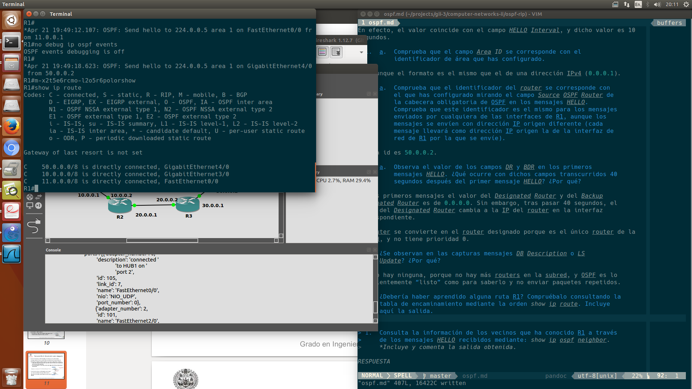

> 1.  Consulta la información de los vecinos que ha conocido R1 a través
>     de los mensajes *HELLO* recibidos mediante: *show ip ospf neighbor*.
>     Incluye y comenta la salida obtenida.

Como era de esperar, la salida del comando está vacía.


> 1.  Consulta la información de la base de datos de *Router Link States*
>     de R1 con: *show ip ospf database router*. Incluye y comenta la
>     salida obtenida*.*

La primera línea nos dice la id del router (`50.0.0.2`), y su id de proceso
interno (`1`).

Se puede ver cómo aparece el número de interfaces, y las IDs y máscaras de red
de las subredes a las que está conectado.

TODO: TOS 0 metrics


> 1.  Consulta la información de la base de datos de *Network Link States*
>     de R1 con: *show ip ospf database network*. Incluye y comenta la
>     salida obtenida.

Esta es la base de datos de los routers que conocen OSPF. Como era de esperar
el único router que aparece es él mismo.

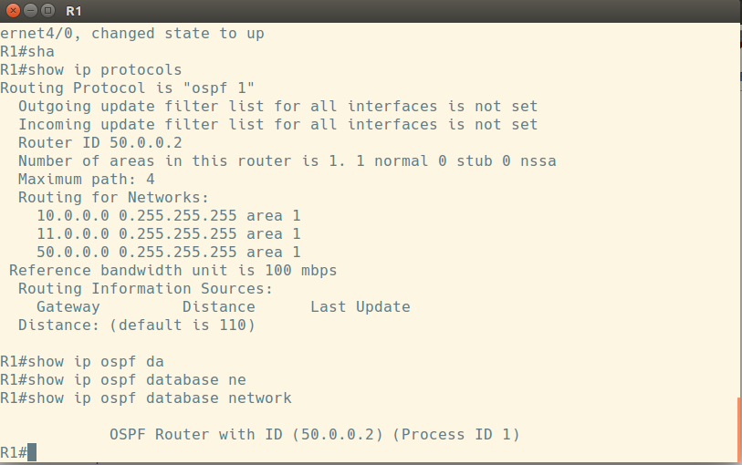

# Activación de R2

> Para observar los mensajes que envíe R2 cuando se active OSPF, y los que
> envíe R1 a consecuencia de la activación de R2, arranca *wireshark* en
> los enlaces de R2 con R1 y R3 y en el enlace de R1 con R5.

> A continuación, configura OSPF en el encaminador R2 para que su
> identificador de *router* sea la mayor de sus direcciones IP y para que
> exporte las rutas hacia las dos redes a las que está conectado. Incluye
> aquí las órdenes:

```
config t
router ospf 1
network 10.0.0.0 255.0.0.0 area 1
network 20.0.0.0 255.0.0.0 area 1
router-id 20.0.0.1
exit
exit
wr
```


> Activa los mensajes de depuración. Incluye aquí la orden

```
debug ip ospf events
```

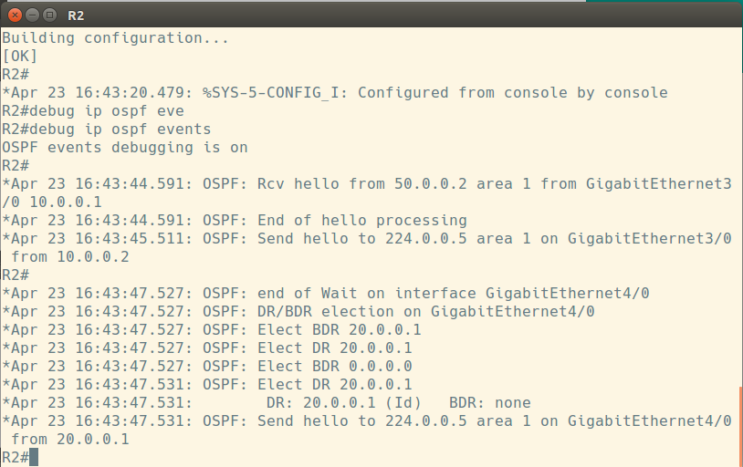

> Espera dos minutos aproximadamente e interrumpe las capturas.
> Analiza el comportamiento de R1 y R2 estudiando las capturas de tráfico,
> los mensajes de depuración, consultando el estado de OSPF y de la orden
> *show ip route ospf* en cada encaminador:

> 1.  Observa la captura realizada entre R1 y R2 y responde a las
>     siguientes cuestiones:
>
>     a.  ¿Qué tipo de mensajes aparecen cuando R1 detecta la presencia de
>         R2 y viceversa? ¿Cuál es su propósito? ¿Qué IP de destino llevan
>         esos mensajes?

Tras el primer mensaje `Hello` de `R2` al grupo multicast, y tras haber recibido
un Hello de `R1` por la misma vía, `R1` y `R2` sincronizan sus bases de datos
usando mensajes `DB Description`.

Estos mensajes van vía unicast al router interesado. Tras esos mensajes se
realizan también `LS requests` (*Link State Requests*) mutuas vía unicast, que
son respondidas con los correspondientes `LS updates` (también vía unicast).

Cuando los routers individuales reciben las updates y cambia la información que
almacenan, informan **al grupo multicast** de que la información ha cambiado con
un `LS Update`, y cuando reciben la información vía multicast, envían la
confirmación también vía multicast (`LS Acknowledge`).

Si la información de su LSDB cambia por los datos contenidos en el `LS Update`,
otro `LS Update` se enviará al grupo multicast.

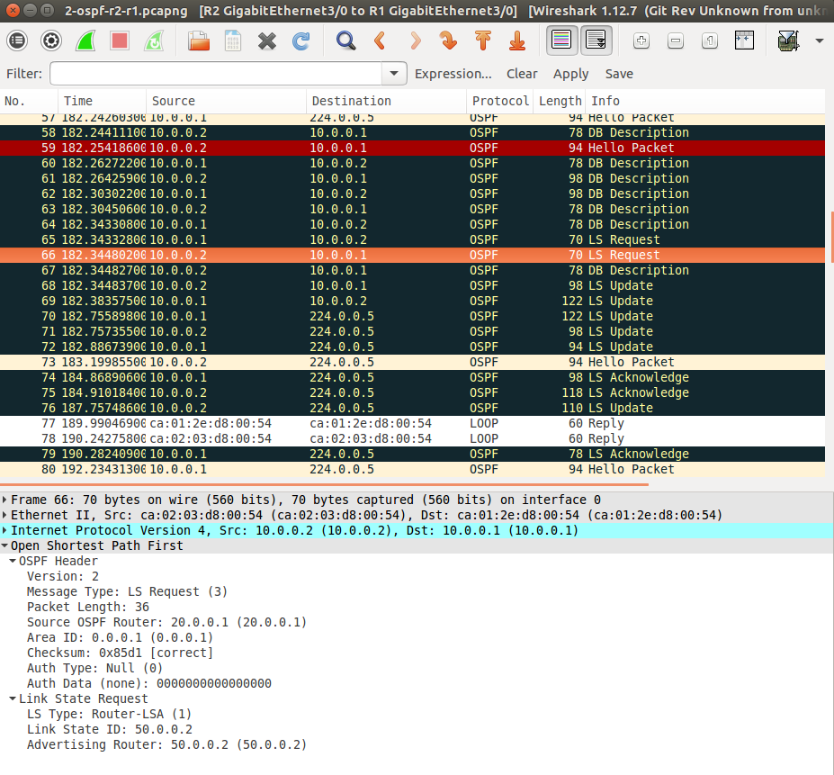

> 1.  a.  Observa los mensajes *LS Request* que envían R1 y R2. ¿Qué *LSA*
>         pide cada uno al otro? ¿Qué IP de destino llevan estos mensajes?

La IP de destino es la IP de la interfaz del router conectada directamente,
pero el *Link State ID* es la ID del router, es decir la IP mayor del router en
este caso.

Por ejemplo, en el primer *LS Request* de R1 a R2, tenemos un mensaje unicast de
la dirección `10.0.0.1` a la dirección `10.0.0.2`, pero como el router OSPF de
origen tenemos `50.0.0.2`, y como *Link State ID* tenemos la `20.0.0.1`, es
decir, las IDs de R1 y R2 respectivamente.

De hecho, el paquete tiene `TTL=1`, por lo que no llegaría si la IP de destino
estuviera en otra subred.

>1.  a.  Observa el primer mensaje *LS Update* que envía R1. Comprueba
>        que se corresponde con el *LS Request* enviado por R2. Comprueba
>        cómo se corresponde su contenido con lo almacenado en la base de
>        datos de R1 analizada en el apartado anterior. Observa sus
>        campos para ver si este mensaje incluye la información de que R1
>        ha descubierto a R2 como vecino. ¿Crees que la información
>        contenida en este mensaje deberá cambiar próximamente? ¿Por qué?
>        Observa el campo *LS Age* del anuncio que viaja en el mensaje, y
>        explica su valor.

Podemos comprobar cómo se corresponde con el de la Request de R2 porque podemos
ver cómo tiene los campos `Link State ID` y `Advertising Router` iguales a la
correspondiente Request (`50.0.0.2`).

No aparece la información de que R1 ha descubierto a R2, aparecen las tres
conexiones directas de R1.

El contenido de este mensaje no tendrá que cambiar, porque es un mensaje
LSA del router, es decir, sólo anuncia las interfaces configuradas, no qué
routers son vecinos o similar[^had-to-drop-this-here], y en R1 ya constaba la
conexión directa con esas tres redes.

Sobre el campo *LS Age*, es cuánto tiempo ha pasado desde que el LSA
correspondiente fue generado. En este caso eran 400 segundos, que era
aproximadamente el tiempo que había pasado desde que encendí el escenario.

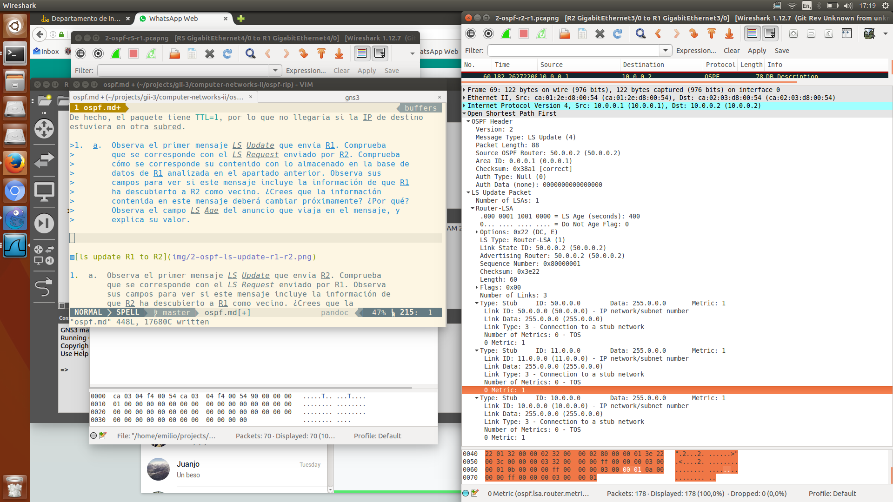

[^had-to-drop-this-here]: Lo siento, tenía que dejar esto aquí:
https://www.youtube.com/watch?v=aPtr43KHBGk

> 1.  a.  Observa el primer mensaje *LS Update* que envía R2. Comprueba
>         que se corresponde con el *LS Request* enviado por R1. Observa
>         sus campos para ver si este mensaje incluye la información de
>         que R2 ha descubierto a R1 como vecino. ¿Crees que la
>         información contenida en este mensaje deberá cambiar
>         próximamente? ¿Por qué? Observa el campo *LS Age* del anuncio
>         que viaja en el mensaje, y explica su valor.

Se puede comprobar de manera análoga, el Link State ID es `20.0.0.1`, que es el
correspondiente al request de R1.

Igualmente, al ser un mensaje Router-LSA no tiene que contener los datos de que
es vecino de R1, sino las interfaces configuradas. En estas no se incluye la
red `20.0.0.0` todavía (supongo que por no tener un DR?), así que tendrá que
cambiar e incluirlo.

El campo LS Age en este caso es de 9 segundos, que entra dentro de lo esperado.

> 1.  a.  Observa el segundo y tercer mensajes *LS Update* que envía R1.
>         ¿Responden a algún *LS Request* previo? ¿Por qué se envían? ¿Qué
>         información contienen? Observa el campo *LS Age* de los anuncios
>         que viajan en los mensajes, y explica su valor.

No, no responden a un LS Request previo, sino que se son enviados al grupo
multicast.

El segundo contiene las interfaces de R1 (router-LSA), con la interfaz
`10.0.0.1` marcada como *transit* en vez de como *stub* (lo que quiere decir que
mi respuesta a la penúltima pregunta era incorrecta). Esto quiere decir que
ahora el tráfico entre routers OSPF puede pasar por esa red. Es enviado porque
la información de la LSDB de R1 ha cambiado.

El tercero es un network-LSA, que contiene los dos routers OSPF conectados a la
red e información sobre ellos (`50.0.0.2` y `20.0.0.1`). Es enviado porque la
información de la topología de la red ha cambiado y R1 es el DR.

El campo LS Age es 1, porque la información acaba de ser incorporada a la LSDB.

> 1.  a.  Observa el segundo mensaje *LS Update* que envía R2. ¿Responde a
>         algún *LS Request* previo? ¿Por qué se envía? ¿Qué información
>         contiene? Observa el campo *LS Age* del anuncio que viaja en el
>         mensaje, y explica su valor.

No, ese segundo mensaje no responde a ningún request, sino que se envía porque
la LSDB de R2 ha cambiado dado que ahora se ha dado cuenta de que estaba
conectado a la red `20.0.0.0`.

El LS Age es 1 por esa misma razón, es información recién añadida a la LSDB.

> 1.  a.  ¿Por qué razón R2 no envía ningún mensaje *Network-LSA*?

Porque no es el DR de la subred.

> 1.  a.  Observa los mensajes *LS Acknowledge*. Mira su contenido para
>        comprobar a qué LSAs asienten.

Podemos comprobar tanto el número de secuencia como el Link State ID (ojo,
**dentro del LSA Header**) para asegurarnos a qué LSA están asintiendo. Estarán
asintiendo a todos los mensajes provenientes del Link State ID y con menor
número de secuencia que los especificados en el paquete.

> 1.  a.  Pasados 40 segundos del arranque de R2, ¿qué ocurre con los
>         campos *DR* y *BDR* de los mensajes *HELLO* que intercambian?

Que R2 se convierte en el BDR de la subred.

> 1.  Observa la captura realizada en R5:
>
>     a.  Explica por qué no aparecen los mensajes *LS Update* que crea R1
>         y envía a R2.

Porque R1 está directamente conectado con R2, y son mensajes unicast.

> 1.  a.  Explica por qué no aparecen los mensajes *LS Update* que crea R2
>         y envía a R1, y R1 debería propagar por inundación.

Porque son mensajes con TTL=1, y por lo tanto son deshechados cuando van a ser
enviados.

> 1.  Observa la captura realizada en R3:
>
>     a.  Explica por qué no aparecen los mensajes *LS Update* que crea R2
>         y envía a R1.

Por la misma razón, R2 sabe que está conectado directamente a R1.

> 1.  a.  Explica por qué no aparecen los mensajes *LS Update* que crea R1
>         y envía a R2, y R2 debería propagar por inundación.

Porque R2 no es el DR, y además los mensajes tienen TTL=1

> 1.  ¿Deberían haber aprendido alguna ruta R2 y R1? Compruébalo
>     consultando la tabla de encaminamiento en ambos encaminadores
>     mediante la orden *show ip route ospf*. Incluye aquí la salida.
>     Comprueba la métrica de cada ruta y a través de qué *router*
>     se alcanza.

Sí, R2 debería haber aprendido a ir a `50.0.0.0` y a `11.0.0.0`, y R1 debería
haber aprendido a ir a `20.0.0.0`.

Podemos ver como es lo que esperábamos:

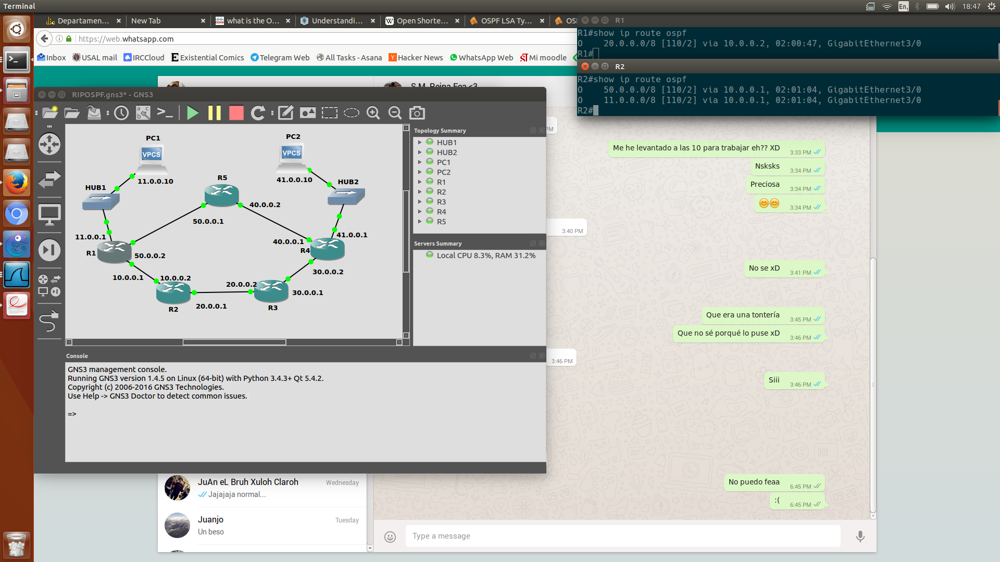

> 1.  Consulta la información de los vecinos que ha conocido cada
>     encaminador a través de los mensajes *HELLO* mediante: *show ip ospf
>     neighbor*. Incluye la salida.


> 1.  Consulta en cada encaminador la información de las bases de datos de
>     *Router Link States* y de *Network Link States* mediante: *show ip
>     ospf database router* y *show ip ospf database
>     network* respectivamente. Comprueba que la información mostrada
>     coincide con el contenido de los últimos *LS Update* enviados por
>     los encaminadores.

Podemos ver como los router link states son idénticos en ambos routers,
y coincide con la información mandada en los últimos Router LS Update de R1
y R2.


Igualmente, podemos ver cómo los Network Link States son iguales, contienen
tanto a R1 como R2, y también se corresponden con el último network LSU de R1 al
grupo multicast:


Nótese que el número de secuencia no se corresponde porque había pasado algo de
tiempo desde la captura, pero los datos no han cambiado.

> 1.  Consulta un resumen de las bases de datos en cada encaminador con:
>     *show ip ospf database*. Incluye y comenta la salida obtenida.

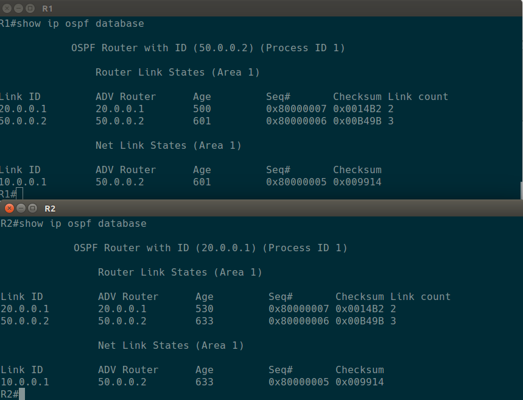

Se puede comprobar como las bases de datos son idénticas (todos los routers
pueden ver la topología de su área).

Los routers actualmente son R1 y R2 (con sus correspondientes IDs), y las redes
son la `10.0.0.0`, cuyo DR es el `50.0.0.2`.

# Activación de R3 y R4

> Para observar los mensajes que envíen R3 y R4 cuando activen OSPF, y los
> que envíe R2 a consecuencia de la activación de R3 y R4, arranca
> *wireshark* en los enlaces entre R1 y R2, entre R2 y R3 y R3 con R4.
>
> Configura OSPF en R3 y en R4. Para tratar de arrancarlos a la vez
> prepara las ordenes necesarias en un fichero de texto para copiar y
> pegar en cada uno de los encaminadores. Escribe aquí las órdenes
> necesarias.

R3:

```
config t
router ospf 1
network 20.0.0.0 255.0.0.0 area 1
network 30.0.0.0 255.0.0.0 area 1
router-id 30.0.0.1
exit
exit
wr
```

R4:

```
config t
router ospf 1
network 30.0.0.0 255.0.0.0 area 1
network 40.0.0.0 255.0.0.0 area 1
network 41.0.0.0 255.0.0.0 area 1
router-id 41.0.0.1
exit
exit
wr
```

Nótese que podríamos haber usado `passive-interface` con R4 (y con R1). No
debería de afectar, pero dada la falta de tiempo, y que la ID de R4 sería (no
obligatoriamente, pero...) la interfaz por la que se usaría `passive-interface`,
no he querido arriesgarme. Cuando haya más tiempo lo pruebo.

> Analiza el comportamiento de los encaminadores estudiando las capturas
> con *wireshark*, los mensajes de depuración, consultando el estado de
> OSPF y de la orden show ip *route ospf* en cada encaminador:
>
> 1.  Trata de suponer los valores de *DR* y *BDR* en las subredes
>     20.0.0.0/8 y 30.0.0.0/8. Comprueba si tus suposiciones son ciertas.
>     Comprueba en los mensajes *HELLO* de la captura en R3 cómo se ha
>     producido la elección de *DR* y *BDR* al arrancar R3 y R4 a la vez.

En la subred `20.0.0.0`, se debería de mantener el DR, y usar a `20.0.0.1` como
BDR, ya que el router `20.0.0.1` ya estaba designado anteriormente, y por lo
tanto el router `20.0.0.2` quedaría como BDR.

En la subred `30.0.0.0`, debería de elegirse al router `30.0.0.2` como DR, por
ser el mayor de los dos, y a `30.0.0.1` como BDR.

Podemos comprobar como estaba en lo cierto:

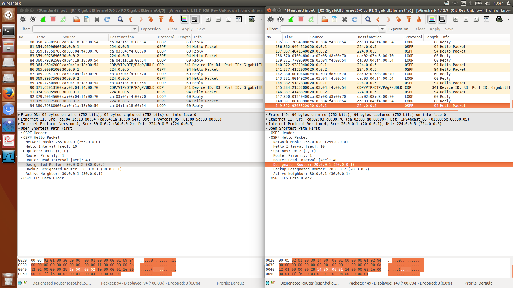

> 1.  En la captura del enlace R3-R4 observa el intercambio de mensajes
>     *LS Update* que se produce mientras arrancan R3 y R4.

Podemos comprobar cómo R3 envía a R4 un total de 5 LSAs (3 router, 2 network)
vía unicast.

Las tres router-LSA corresponden con los LSA de `20.0.0.1`, con los de
`30.0.0.1` (los propios), y con los de `50.0.0.2`, que contienen toda la
topología de red que conoce R3 en el momento.

Sin embargo, R4 envía otro LS Update, pero sólo con Router-LSA, que es lo que él
conoce en el momento, que son los stubs de las redes a donde está conectado.

Tras recibirlo R3 lanza al grupo multicast un Router-LSA, con él ya como DR y la
red `30.0.0.0` en el estado `Transit` en vez de Stub, y posteriormente (también
al grupo multicast) un Network-LSA con las dos IDs como adyacentes (`30.0.0.1`
y `41.0.0.1`).

> 1.  En la captura del enlace R2-R3 observa el intercambio de mensajes
>     *LS Update* que se produce mientras arrancan R3 y R4. Observa
>     también en dicha captura los mensajes *LS Update* que R3 envía por
>     inundación de los recibidos por el de R4. Indica cómo puedes saber
>     si un *LS Update* lo ha originado el encaminador que lo envía o está
>     siendo propagado por inundación.

Se puede comprobar si un LS Update ha sido propagado mirando el `Advertising
Router`. En este caso por ejemplo, se ven varios updates con las redes
`41.0.0.0`, `40.0.0.0` y `30.0.0.0` que vienen por parte de `R4`.

> 1.  Antes de examinar la captura en el enlace de R1-R2 trata de suponer
>     qué tipos de mensaje aparecerán en ella. Comprueba tus suposiciones.

Supongo que llegarán mensajes propagados tanto de R3 como de R4, con las nuevas
rutas, y los routers ya existentes necesitarán sincronizar las LSDB.

Podemos ver como ese es el caso, efectivamente recibiendo incrementalmente las
actualizaciones por parte de R3 y R4, por parte de R2 claro (`10.0.0.2`), y con
los correspondientes acklowdedges de R1.

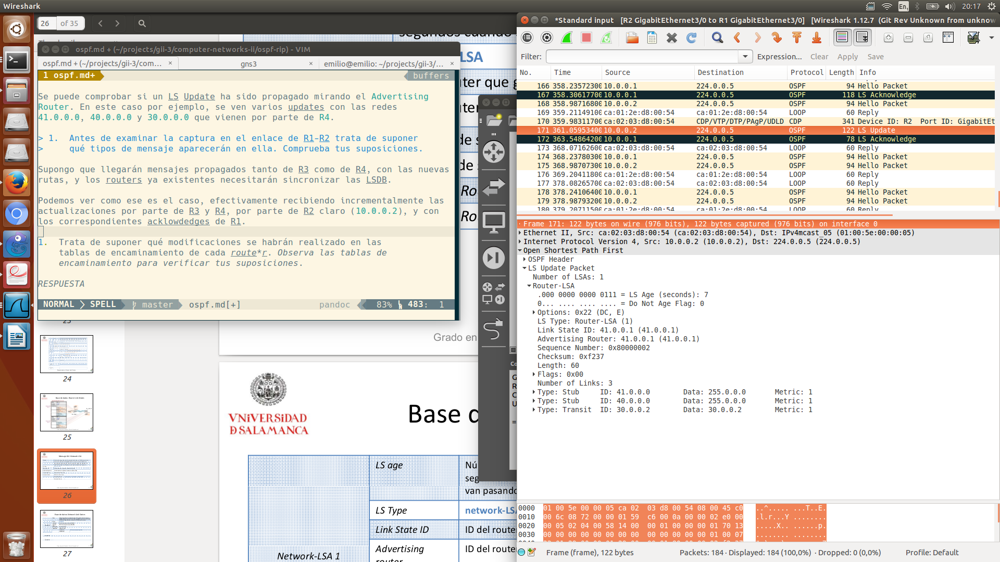

> 1.  Trata de suponer qué modificaciones se habrán realizado en las
>     tablas de encaminamiento de cada *router*. Observa las tablas de
>     encaminamiento para verificar tus suposiciones.

Ahora mismo todos los routers tendrían que tener todas las subredes como
accesibles dentro de sus tablas de encaminamiento, con más o menos saltos (por
ejemplo, R1 tendrá las redes `40.0.0.0` y `41.0.0.0` con la métrica más alta,
4 si no me equivoco, debería ser 1 menos que RIP).

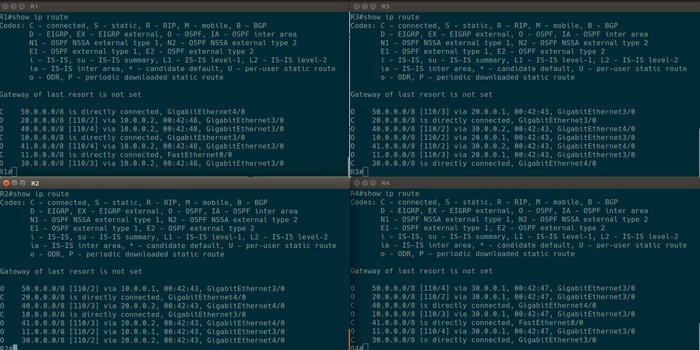

> 1.  Consulta la información de los vecinos que ha conocido cada
>     encaminador a través de los mensajes *HELLO*.

Podemos hacerlo fácilmente con `show ip ospf neighbor`:

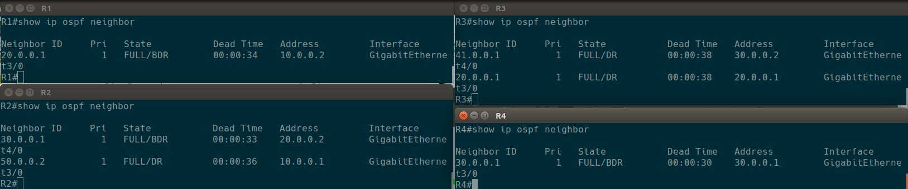


> 1.  Consulta en cada encaminador la información de las bases de datos de
>     *Router Link States* y de *Network Link States*. Comprueba que la
>     información mostrada coincide con el contenido de los últimos *LS
>     Update* enviados por los encaminadores.

No se incluye la captura aquí por ser demasiado grande, y la información se
puede encontrar abajo, pero se puede comprobar cómo en efecto la correspondencia
existe, y coincide con los últimos mensajes LS Update salvo por los
cambios en números de secuencia dada la diferencia de tiempo.

> 1.  Consulta el resumen de las bases de datos en cada encaminador.

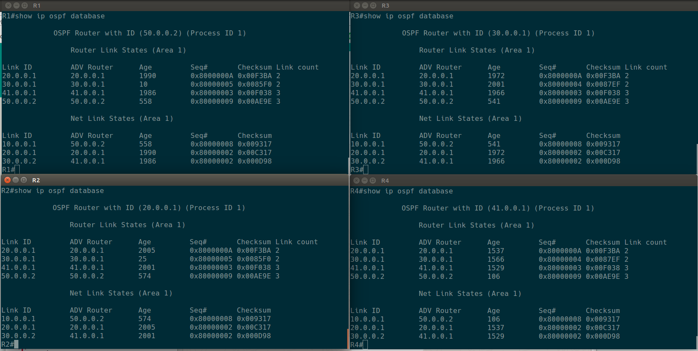

> 1.  Tras haber arrancado OSPF en los encaminadores R1, R2, R3 y R4, PC1
>     y PC2 deberían tener conectividad IP. Compruébalo con las órdenes
>     *ping* y trace (incluye aquí su salida).

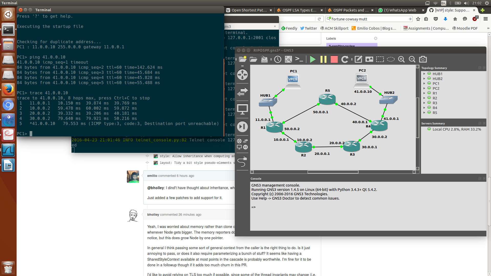

# Reconfiguración de rutas: activación y desactivación de R5

> 1.  Deja lanzado el *ping* de PC1 a PC2 (*ping 40.0.0.10 -t*), y
>     reinicia OSPF en R1 *(clear ip ospf 1 process*). ¿Se ha producido
>     pérdida de paquetes? ¿Por qué? Comprueba lo que ha sucedido con las
>     capturas de tráfico necesarias. Compara lo sucedido para esta misma
>     situación en la práctica de RIP.

Podemos comprobar cómo **sí se pierden paquetes** (unos 10 aproximadamente),
porque se tiene que volver a rehacer toda la reelección de DBR y sincronización
de la LSDB.

Podemos ver en el debug log de OSPF cómo el mayor período de pérdida de paquetes
es hasta que recibe intercambian los DBD (*DataBase Descriptor*), es decir,
sincronizan las bases de datos, y recibe el primer LS Update de R2.

A diferencia de RIP, donde todo el estado estaba disponible dentro de la red
multicast, y era proveído casi instantáneamente por los vecinos, en OSPF, dada
la mayor complejidad del protocolo, la información tarda bastante más en estar
disponible.

> 1.  Realiza los cambios necesarios para que la ruta seguida por los
>     datagramas IP que envía PC1 a PC2 vayan por la ruta $PC1 \rightarrow R1
>     \rightarrow R5 \rightarrow R4 \rightarrow PC2$, y para que los que envía
>     PC2 a PC1 sigan la ruta $PC2 \rightarrow R4 \rightarrow R5 \rightarrow R1
>     \rightarrow PC1$. Para realizar este apartado no podrás añadir o eliminar
>     manualmente rutas en las tablas de encaminamiento. Mirando la tabla de
>     encaminamiento de R1, observa y apunta el número de segundos que
>     aproximadamente tarda en aprender R1 la nueva ruta.

Al igual que en la anterior práctica, con configurar R5 adecuadamente (en
este caso con OSPF) debería de ser suficiente. Vamos a comprobarlo
experimentalmente:

```
config t
router ospf 1
network 50.0.0.0 255.0.0.0 area 1
network 40.0.0.0 255.0.0.0 area 1
router-id 50.0.0.1
exit
exit
wr
```

La ruta la ha aprendido relativamente rápidamente (estaba copiando el tiempo del
primer `recv hello` (`00:49:14.251`), y cuando he querido poner la tabla de
rutas (un par de segundos) ya la conocía.

> Comprueba que se está utilizando dicha ruta a través de la orden
> *trace*. Comprueba las rutas y sus métricas en las tablas de
> encaminamiento de cada encaminador. Compara este valor con el anotado
> para esta misma situación en la práctica de RIP.


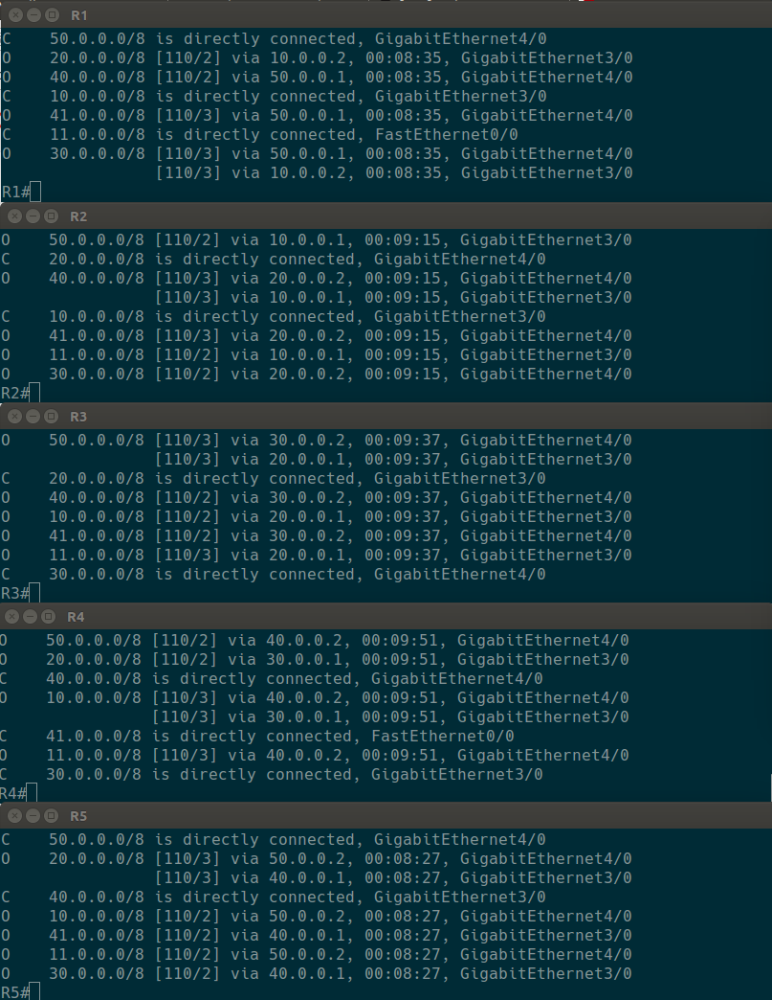

> 1.  Deja lanzado en PC1 un *ping* hacia PC2. Lanza las capturas de
>     tráfico necesarias para explicar qué sucede cuando se interrumpe la
>     ejecución de OSPF en el encaminador R5 (utiliza la orden *no router
>     ospf <num>*). Podrás observar con la orden *show ip route*
>     que ahora R5 no conoce rutas aprendidas por OSPF. Tampoco exporta
>     información de vecinos hacia otros encaminadores.
> 2.  ¿Deja de funcionar el *ping* de PC1 a PC2? ¿durante cuánto tiempo?
>     (fíjate en el número de secuencia *icmp\_seq*, éste aumenta con cada
>     paquete enviado cada segundo).

Podemos comprobar como sí se pierde tráfico, durante 3 segundos aproximadamente,
pero nada excesivamente importante.

Este poco tiempo de downtime se puede explicar porque el router 5 manda un
paquete LS Update a R1 cuando es desconfigurado, que R1 propaga inmediatamente.
R1 puede entonces re-enrutar los paquetes por R2 inmediatamente[^ack].

[Captura de tráfico al deshabilitar R5](img/4-ospf-disable-r5.png)

[^ack]: ¿Es en cuanto realiza R1 el ack del LS Update de R2? Es lo que parece, ya
que se ven un par de paquetes lanzados hacia R5 tras el LS ack de R1, pero
podría ser que R1 tardara en re-evaluar las rutas.

> 1.  Observa durante este periodo, en el que no está funcionando R5, la
>     tabla de encaminamiento de R1 y R4 y su lista de vecinos. Describe
>     lo que ocurre. Muestra aquí la evolución de estas tablas. ¿Cuánto
>     tiempo tardan R1 y R4 en olvidar las rutas por R5 y aprender las
>     nuevas? ¿por qué? ¿Cuánto tiempo tarda R5 en desaparecer de la lista
>     de vecinos de R1 y R4? ¿por qué? Ayúdate de las capturas del tráfico
>     para explicar lo sucedido y contestar adecuadamente a las
>     preguntas anteriores. Compara lo sucedido para esta misma situación
>     en la práctica de RIP.

Parte de esta respuesta está respondida arriba. Tras otra comprobación, esa
rápida propagación del LS Update mandado por el mismo R5 hacia R1 es la causante
del rápido olvido de esas rutas y esos vecinos.

Se propaga el LS Update de las rutas de R5 por toda la red, y es cuando recibe
R1 otro update por parte de R2, con las nuevas rutas que él tiene para llegar
a las redes `40.0.0.0` y `50.0.0.0` cuando comienza a enviar paquetes por R2
para llegar a `PC2`.

Nótese que en dicho LS Update de R2 no viene información explícita sobre cómo
llegar a `41.0.0.0`, sino sólo de las rutas que han cambiado. R1 ya sabe el
estado de los links de R4 (y que es el único router por el que llegar a `PC2`,
por lo que no le hace falta esa información de nuevo.

Podemos comprobar que, gracias a tener esa actualización cuando cambia (que
sería equivalente a tener triggered updates en RIP cuando se desconfigura), el
tiempo durante el cual los datos de la tabla de rutas son erróneos es mucho
menor.

Sería interesante comprobar cuánto se tarda si el fallo fuera por un apagón (y
por lo tanto ese último LS Update no se realizara). No creo que tenga tiempo
antes de entregar esta práctica, pero probablemente lo pruebe con más calma.

> 1.  Interrumpe el *ping* y comprueba la ruta que están siguiendo los
>     mensajes intercambiados entre PC1 y PC2 con *trace*. Incluye aquí la
>     salida

Podemos comprobar como pasa por R2:

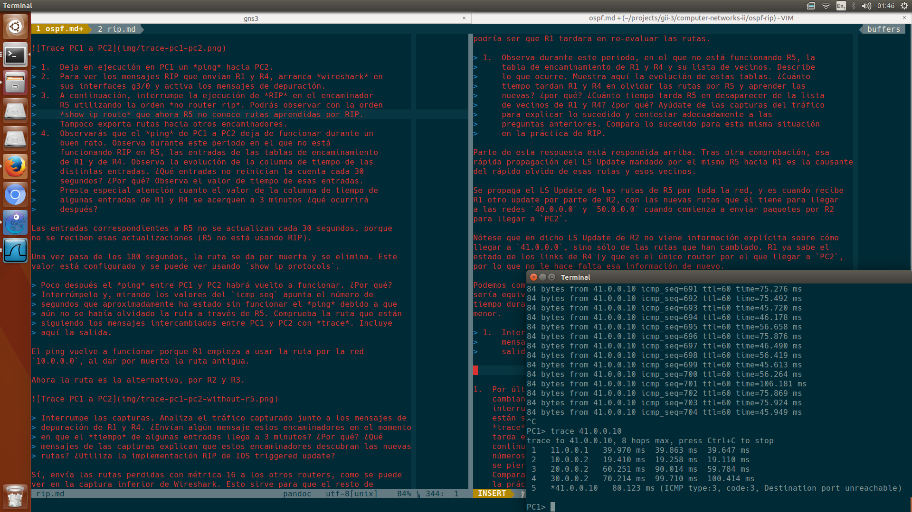

> 1.  Por último, vuelve a configurar de nuevo *OSPF* en R5. Observa cómo
>     cambian las tablas de encaminamiento en R1 y R4 y apenas se
>     interrumpe el *ping*. Comprueba de nuevo cuál es ahora la ruta que
>     están siguiendo los mensajes intercambiados entre PC1 y PC2 con
>     *trace*. Observa y apunta el número de segundos que aproximadamente
>     tarda en aprenderse de nuevo la ruta a través de R5, mirando
>     continuamente la tabla de encaminamiento de R1. Mira también los
>     números de secuencia de los *icmps* del *ping*, y fíjate si alguno
>     se pierde mientras se cambia de la ruta antigua a la ruta nueva.
>     Compara estos datos con los observados para esta misma situación en
>     la práctica de RIP.

Podemos ver cómo no se pierde ni un sólo paquete. Las tablas de encaminamiento
están actualizadas en cuestión de un par de segundos, y la ruta que se sigue
pasa a ser R5 prácticamente instantáneamente (desde que se estabiliza todo de
nuevo y se reciben los correspondientes acknowledges).

Este tiempo es ligeramente más lento que RIP. Ya he comentado esto con más
detalle arriba, pero resumiendo, en RIP no hace falta tanta sincronización como
en OSPF (en cuanto un vecino se daba cuenta de que había un vecino nuevo le
mandaba los datos correspondientes).

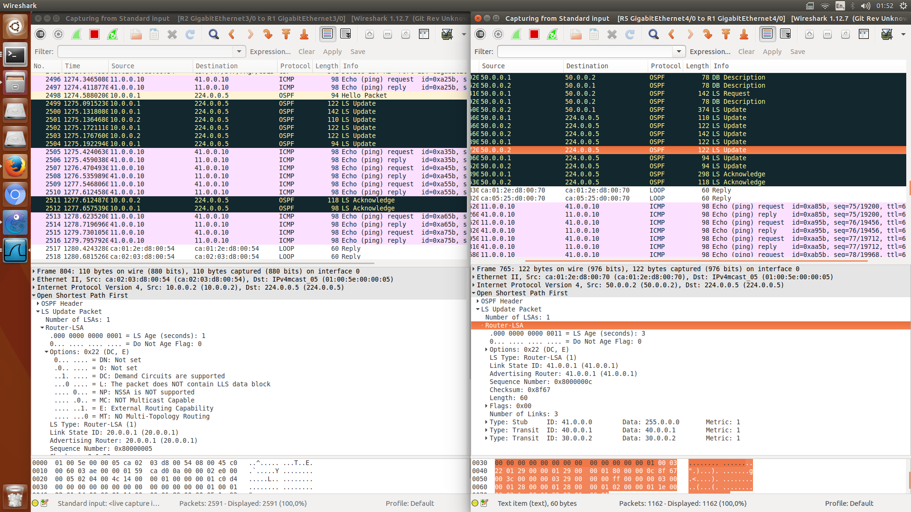
