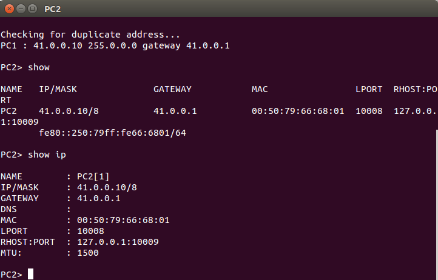
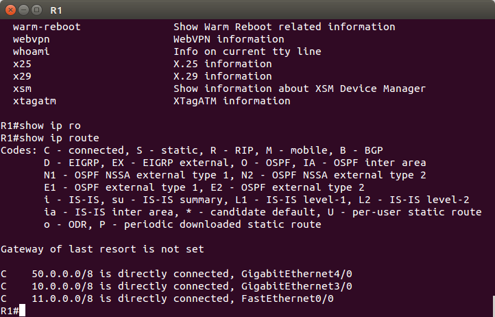
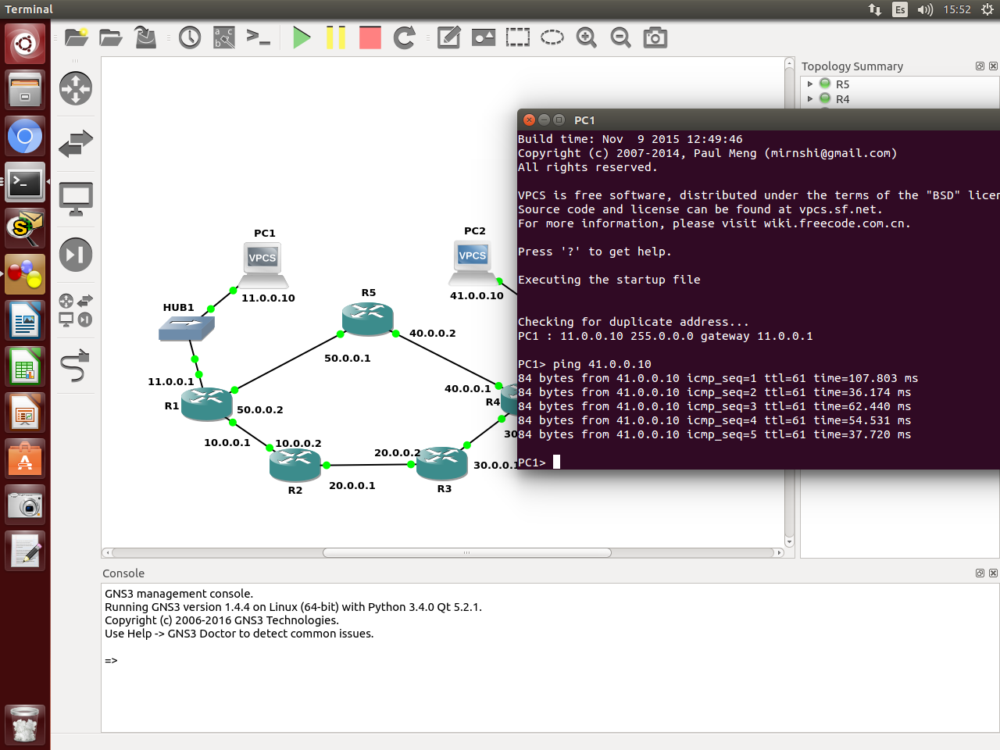
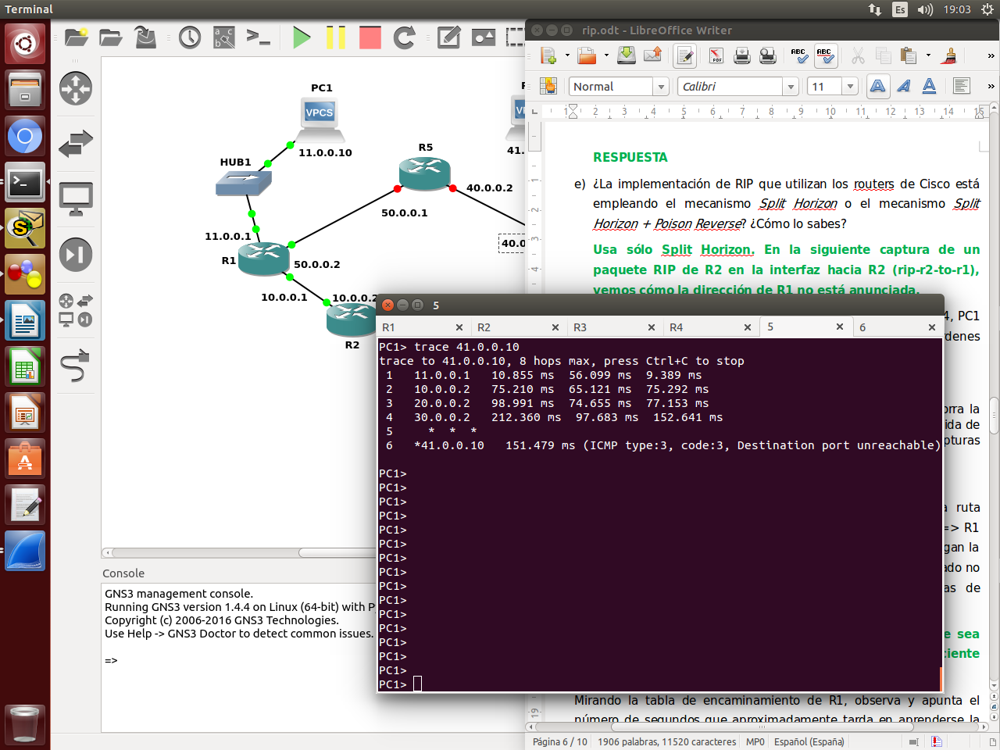
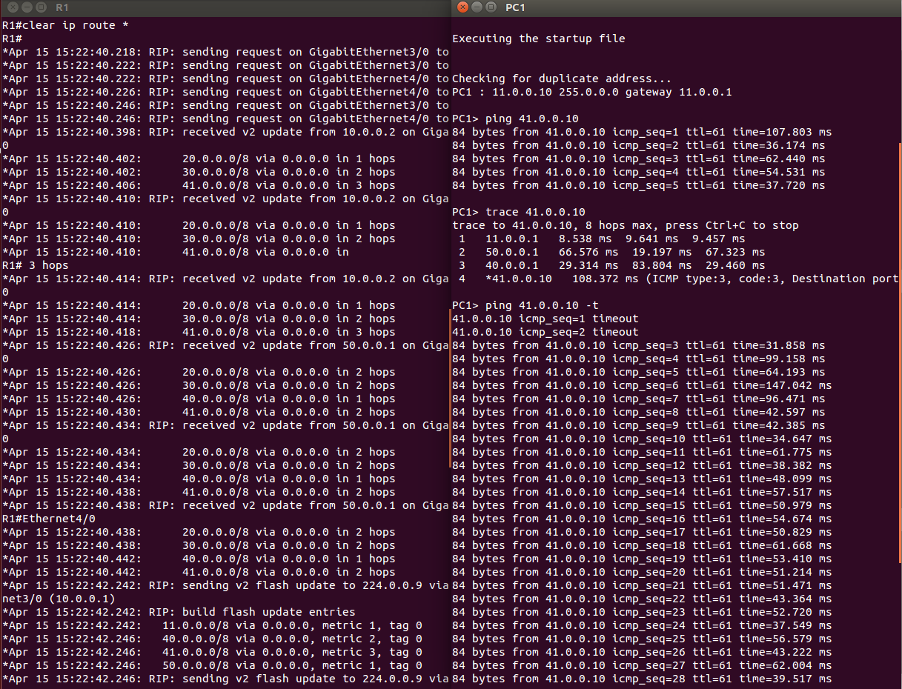
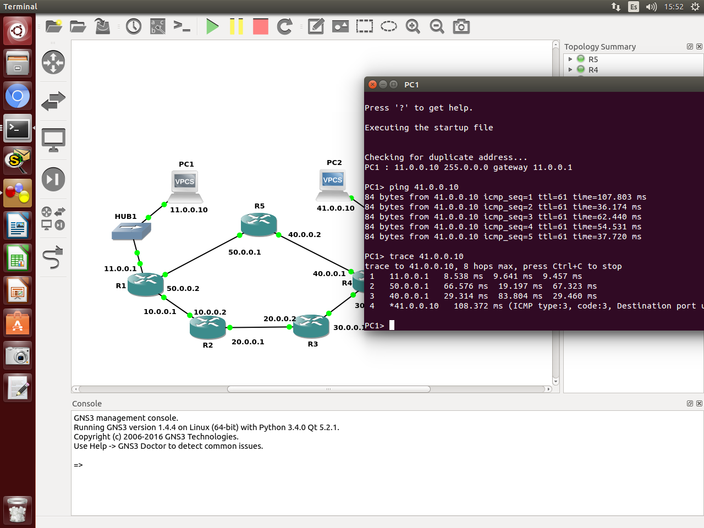
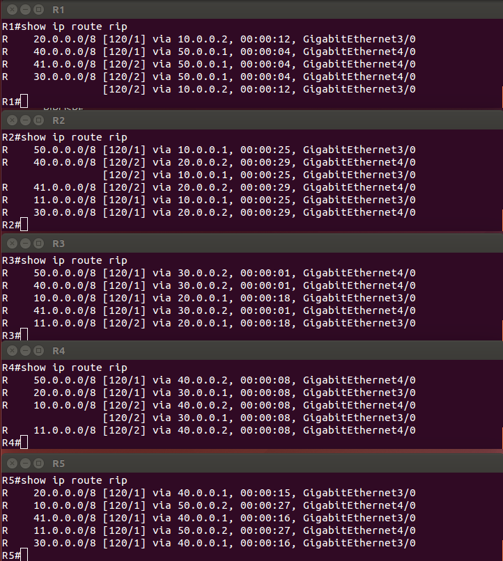
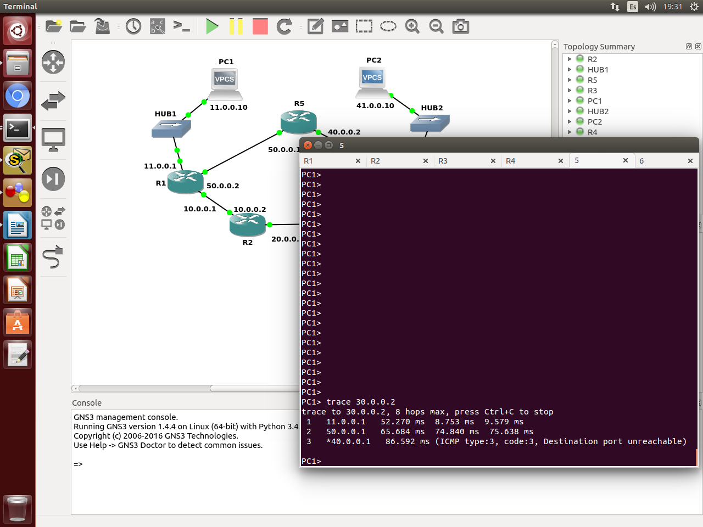

# Cómo realizar un buen informe

-   Al ir realizando todas las actividades que se proponen se han de
    documentar todos los pasos, adjuntando las órdenes (comandos
    o actividades) realizadas junto con las capturas de pantalla de su
    ejecución, explicando siempre la salida obtenida. No es suficiente
    con una captura de pantalla sin texto que acompañe a la imagen y lo
    contrario tampoco; es decir, adjuntar la orden (o comando) sin
    aportar prueba alguna de que se ejecutó realmente y sin una
    interpretación de la salida o resultado obtenido.
-   En el informe se ha demostrar que se han realizado y entendido todas
    las actividades propuestas.
-   En la entrega de la práctica se han de adjuntar todos los ficheros
    auxiliares que hayan sido utilizados y que no se incluyan en
    el informe. Por ejemplo: el escenario final obtenido, los ficheros
    de capturas del tráfico de red, scripts realizados para automatizar
    tareas, etc.
-   **Contestar en color verde para diferenciar claramente las
    respuestas del enunciado.**

# Funcionamiento básico

> En el fichero *RIPOSPF.rar* está definida una red como la que se muestra en la
> Figura 1. Descomprime el fichero de configuración del escenario *RIPOSPF.rar*
> en la carpeta correspondiente de GNS3.
>
> Arranca todas las máquinas y abre una consola con cada una de ellas
> (orden *consolas*). Los equipos PC1 y PC2 tienen rutas por defecto a R1
> y R4 respectivamente. Compruébalo con la orden *show o show ip* (Incluye
> aquí esa información).




> Los *routers* no tienen configurada ninguna ruta, salvo la de las
> subredes a las que están directamente conectados. Compruébalo con la
> orden *show ip route* (Incluye aquí esa información).




> En los siguientes apartados se configurará RIP en los *routers* para que
> las tablas de encaminamiento permitan alcanzar cualquier punto de la
> red.
>
> 1.  Para observar los mensajes que envíe R1 cuando se active RIP,
>     arranca *wireshark* en todos los enlaces de R1. A continuación
>     configura RIP en R1 para que exporte las rutas de las tres redes a
>     las que está conectado.

```
config t
router rip
version 2
network 10.0.0.0
network 11.0.0.0
network 50.0.0.0
no auto-summary
exit
exit
wr
```


> Activa la depuración de los mensajes rip: *debug ip rip*
>
> Espera un minuto aproximadamente e interrumpe las capturas.
>
> Interrumpe también los mensajes de depuración: no *debug ip rip*
>
> Analiza el comportamiento de R1 estudiando las capturas del tráfico y
> los mensajes de depuración para responder a las siguientes preguntas:
>
> Observa los mensajes REQUEST que se envían al arrancar *RIP* en R1 y analiza su
> contenido. ¿Son iguales en todas las interfaces? ¿Para qué se utilizan? ¿Qué
> rutas viajan en estos mensajes? ¿Quién responde a estos mensajes?

Sí, todos los mensajes `REQUEST` son iguales para todas las interfaces, se
utilizan para que otros routers que estén potencialmente escuchando en el
grupo multicast de RIP v2 manden las rutas tan pronto como puedan.

Obviamente no hay respuesta (no hay ningún otro router configurado con RIP).
Esos mensajes son mensajes a dicho grupo multicast `224.0.0.9`, aunque con
`TTL=2`. No obstate sólo llegan a los routers vecinos[^ttl-2], al ser un
paquete multicast local.

Sobre el porqué el ttl es 2, he encontrado alguna información
interesante[^ttl2-1][^ttl2-2].

[^ttl2-1]: https://learningnetwork.cisco.com/thread/40817,
[^ttl2-2]: http://stackoverflow.com/questions/9745429/why-is-eigrp-and-rip-uses-ip-ttl-of-2-cisco


> Observa los mensajes RESPONSE que envía R1 periódicamente a través de cada una
> de sus interfaces. ¿Son iguales en todas las interfaces? ¿Qué rutas viajan en
> estos mensajes?

No, no todos los mensajes son iguales para todas las interfaces, por ejemplo,
no anuncia que puede conectarse a la red `11.0.0.0` por esa misma red.

Así, al hub son anunciadas las redes `50.0.0.0` y `10.0.0.0`, a la red
`10.0.0.0` son anunciadas las redes `11.0.0.0` y `50.0.0.0`, y a la red
`50.0.0.0` son anunciadas las redes `10.0.0.0` y `11.0.0.0`.

> ¿Debería haber aprendido alguna ruta R1? Compruébalo consultando la tabla de
> encaminamiento mediante la orden *show ip route*.

No, ya que no ha obtenido ninguna respuesta de ninguno de los otros routers,
así que todavía sólo conocerá las redes a las que está directamente conectado.

> Ejecuta en R1 la orden *show ip protocols*. ¿Qué información nos facilita?
> Adjunta y comenta la salida obtenida.

Nos facilita múltiples aspectos de la configuración del router, entre ellos
cómo está configurado con RIP, y con qué parámetros (tiempo de olvido,
periodo actualización...).

%%% TODO: captura (olvidada)

> ¿Para qué sirve la orden `passive-interface <interface>`? ¿Sería útil
> configurar en R1 alguna de sus interfaces de este modo?. Incluye aquí la
> orden.

Suprime las actualizaciones del routing en una interfaz, es decir, que
no manda actualziaciones a esa interfaz.

Es útil, por ejemplo, configurar la interfaz `FastEthernet` así (la asociada
al hub), ya que sabemos que no hay ningún otro router asociado a esa interfaz.

La orden es: `passive-interface FastEthernet 0/0`

> Utiliza esta orden en el resto de routers del escenario en los que sea
> necesario.

> Ve configurando y arrancando a continuación RIP en los encaminadores R2, R3
> y R4, de uno en uno: primero en R2, luego en R3 y finalmente en R4. Cada vez que
> configures uno de esos encaminadores realiza las capturas que estimes
> conveniente, estudiándolas junto con los mensajes de depuración y responde a las
> siguientes cuestiones:
>
> Incluye las órdenes de configuración.

Se omiten las partes repetitivas para no sobrecargar la hoja:

R2:

```
  network 20.0.0.0
  network 10.0.0.0
```

R3:

```
network 20.0.0.0
network 30.0.0.0
```

R4:

```
network 30.0.0.0
network 40.0.0.0
network 41.0.0.0
passive-interface FastEthernet 0/0
```

> Comprueba el envío de mensajes REQUEST. ¿Existe algún mensaje de RESPONSE
> a esos REQUEST? ¿Por qué?

En las interfaces donde no hay ningún router RIP conectado (y no son
passive-interface) sí hay un mensaje REQUEST, pero sólo obtendrán RESPONSE
a través de las interfaces que sí tienen un router RIP. No obstante, esos
RESPONSE no están dirigidos directamente a ese router, sino al grupo
multicast.

Aparte, una vez guardas la configuración, el router envía un mensaje
RESPONSE con las redes al grupo multicast[^ripv1].

[^ripv1]:
  Como dato curioso, al configurar uno de los routers se me olvidó
  escribir "version 2" antes de los comandos "network ...", y se vió un
  mensje del tipo REQUEST del protocolo RIPv1 (obviamente sin respuesta),
  aunque fue corregido rápidamente.

> Comprueba la tabla de encaminamiento del encaminador recién arrancado, así
> como las tablas de encaminamiento del resto de los encaminadores para ver cómo
> se van propagando las rutas. Explica el proceso de aprendizaje de rutas
> apoyándote en las capturas realizadas y en los mensajes de depuración.

El proceso de aprendizaje no es especialmente complicado. El router
inicialmente sólo sabe las rutas a las que está conectado directamente.

En cuanto configuras RIP, el router envía un mensaje REQUEST a cada interfaz,
que es rápidamente contestado con la tabla de rutas de los routers
**directamente conectados** a esa interfaz.

Si esas tablas no estuvieran actualizadas, una vez pasaran 30 segundos se
volverían a mandar, presumiblemente actualizadas esta vez, y el router
sobrescribiría las entradas correspondientes con la información más nueva.

Si los routers tuvieran triggered updates, no habría que esperar a otro ciclo
para actualizarlas, sino que en cuanto una de las tablas de los routers
vecinos cambiara, el cambio sería propagado instantáneamente.

El router también envía un RESPONSE nada más es configurado con RIP con las
rutas a las que está conectado directamente.

> Comprueba la métrica de cada una de las rutas aprendidas. Detállalas
> a continuación.

Las métricas son las esperadas:

 * R1: Métrica 1 a `20.0.0.0`, 2 a `30.0.0.0`, y 3 a `40.0.0.0` y `41.0.0.0`.
 * R2: Métrica 1 a `11.0.0.0`, `50.0.0.0` y `30.0.0.0`, y 2 a `40.0.0.0`
 y `41.0.0.0`.
 * R3: Métrica 1 a `10.0.0.0`, `40.0.0.0` y `41.0.0.0`, métrica 2 a `50.0.0.0`
 y `11.0.0.0`.
 * R4: Métrica 1 a `20.0.0.0`, 2 a `10.0.0.0`, y 3 a `50.0.0.0` y `11.0.0.0`.

%% TODO: captura, sólo tengo con los 5 routers %%

> ¿La implementación de RIP que utilizan los routers de Cisco está empleando el
> mecanismo *Split Horizon* o el mecanismo *Split Horizon + Poison Reverse*?
> ¿Cómo lo sabes?

Estos routers utilizan tanto split horizon como poison reverse, ya que
reenvían las rutas inalcanzables con métrica 16 a los otros routers.

El ejemplo se verá después, cuando se desconecte R5.

> Tras haber arrancado RIP en los encaminadores R1, R2, R3 y R4, PC1 y PC2
> deberían tener conectividad IP. Compruébalo con las órdenes *ping* y trace
> (incluye aquí su salida).





> Deja lanzado el *ping* de PC1 a PC2 (*ping 40.0.0.10 -t*), y borra la tabla de
> rutas de R1 (`clear ip route *`). ¿Se ha producido pérdida de paquetes? ¿Por
> qué? Comprueba lo que ha sucedido con las capturas de tráfico necesarias.

No, no se ha producido pérdida de paquetes, ya que nada más se limpia la tabla
de rutas se manda un REQUEST a los routers adyacentes, que es casi
inmediatamente respondido.



> A continuación, realiza los cambios necesarios para que la ruta seguida por los
> datagramas IP que envía PC1 a PC2 sea $PC1 \rightarrow R1 \rightarrow R5
> \rightarrow R4 \rightarrow PC2$, y para que los que envía PC2 a PC1 sigan la
> ruta $PC2 \rightarrow R4 \rightarrow R5 \rightarrow R1 \rightarrow PC1$. Para
> realizar este apartado no podrás añadir o eliminar manualmente rutas en las
> tablas de encaminamiento. Describe las acciones realizadas.

Lo único necesario que hay que hacer para ello es configurar RIP en R5 de
manera análoga a como se ha hecho en el resto de los routers, y esperar a que
las rutas se propaguen.

Es fácil de ver cómo esas rutas son las rutas con menor número de saltos entre
sendos PC.

> Mirando la tabla de encaminamiento de R1, observa y apunta el número de
> segundos que aproximadamente tarda en aprenderse la nueva ruta. ¿Por qué?

El tiempo de aprendizaje de dicha ruta es prácticamente instantáneo, dado el
RESPONSE que manda R5 nada más es configurado.

> Comprueba que se está utilizando dicha ruta a través de la orden *trace*.



> Comprueba las rutas y sus métricas en las tablas de encaminamiento de cada
> encaminador. Inclúyelas aquí. Comenta la salida.

Las métricas son, otra vez, las esperadas, y gracias a RIP, hemos conseguido
que ningún paquete de una red a otra tarde más de dos saltos en llegar al
destinatario.



> ¿Por qué ruta deberían ir los datagramas IP que envíe PC1 a la dirección
> `30.0.0.2`? Justifica la respuesta. Comprueba tu respuesta utilizando *trace*.

Podría ir tanto por la red `10.0.0.0` como por la red `50.0.0.0`, ya que la
métrica es la misma para ambas redes (hay el mismo número de saltos).

Usando `trace` comprobamos que la ruta escogida es la `50.0.0.0`.



> Con la misma red del escenario, y con los 5 encaminadores con RIP activado,
> ¿Podrían haber seguido otra ruta los datagramas IP PC1 a la dirección
> 30.0.0.2? ¿Cómo actúan los routers CISCO cuando reciben una ruta con igual
> métrica que la que ya tienen en su tabla de rutas?

Se puede comprobar arriba cómo los routers CISCO almacenan ambas rutas con la
misma métrica, en vez de descartar la menos actualizada.

En teoría, según la documentación[^load-balancing-docs], se usa para hacer
load balancing, es decir, distribuir paquetes equitativamente.

[^load-balancing-docs]:
http://www.cisco.com/c/en/us/support/docs/ip/border-gateway-protocol-bgp/5212-46.html

# Eliminación de rutas

> El objetivo de este apartado es observar lo que ocurre cuando se interrumpe
> *RIP* en R5. Se estudiará, en particular, el comportamiento de los
> encaminadores R1 y R4.

Asegúrate de que los 5 encaminadores tienen arrancado *RIP*. Comprueba la ruta
que están siguiendo los mensajes intercambiados entre PC1 y PC2 con *trace*.


> 1.  Deja en ejecución en PC1 un *ping* hacia PC2.
> 2.  Para ver los mensajes RIP que envían R1 y R4, arranca *wireshark* en
>     sus interfaces g3/0 y activa los mensajes de depuración.
> 3.  A continuación, interrumpe la ejecución de *RIP* en el encaminador
>     R5 utilizando la orden *no router rip*. Podrás observar con la orden
>     *show ip route* que ahora R5 no conoce rutas aprendidas por RIP.
>     Tampoco exporta rutas hacia otros encaminadores.
> 4.  Observarás que el *ping* de PC1 a PC2 deja de funcionar durante un
>     buen rato. Observa durante este periodo en el que no está
>     funcionando RIP en R5, las entradas de las tablas de encaminamiento
>     de R1 y de R4. Observa la evolución de la columna de tiempo de las
>     distintas entradas. ¿Qué entradas no reinician la cuenta cada 30
>     segundos? ¿Por qué? Observa el valor de tiempo de esas entradas.
>     Presta especial atención cuanto el valor de la columna de tiempo de
>     algunas entradas de R1 y R4 se acerquen a 3 minutos ¿qué ocurrirá
>     después?

Las entradas correspondientes a R5 no se actualizan cada 30 segundos, porque
no se reciben esas actualizaciones (R5 no está usando RIP).

Una vez pasa de los 180 segundos, la ruta se da por muerta y se elimina. Este
valor está configurado y se puede ver usando `show ip protocols`.

> Poco después el *ping* entre PC1 y PC2 habrá vuelto a funcionar. ¿Por qué?
> Interrúmpelo y, mirando los valores del `icmp_seq` apunta el número de
> segundos que aproximadamente ha estado sin funcionar el *ping* debido a que
> aún no se había olvidado la ruta a través de R5. Comprueba la ruta que están
> siguiendo los mensajes intercambiados entre PC1 y PC2 con *trace*. Incluye
> aquí la salida.

El ping vuelve a funcionar porque R1 empieza a usar la ruta por la red
`10.0.0.0`, al dar por muerta la ruta antigua.

Ahora la ruta es la alternativa, por R2 y R3.


> Interrumpe las capturas. Analiza el tráfico capturado junto a los mensajes de
> depuración de R1 y R4. ¿Envían algún mensaje estos encaminadores en el momento
> en que el *tiempo* de algunas entradas llega a 3 minutos? ¿Por qué? ¿Qué
> mensajes de las capturas explican que estos encaminadores descubran las nuevas
> rutas? ¿Utiliza la implementación RIP de IOS triggered update?

Sí, envía las rutas perdidas con métrica 16 a los otros routers, como se puede
ver en la captura inferior de Wireshark. Esto sirve para que el resto de
routers eliminen las rutas a las redes `40.0.0.0` y `41.0.0.0` via R1 de sus
tablas más rápidamente, y es lo que se conoce como *Poison Reverse*.

No, los routers no tienen configurado los triggered updates, sino que se envían
periódicamente.

> Vuelve a configurar de nuevo *RIP* en R5. Observa cómo cambian las tablas de
> encaminamiento en R1 y R4. ¿Cuánto tiempo han tardado en aprender la nueva
> ruta? ¿Por qué? Comprueba de nuevo cuál es ahora la ruta que están siguiendo
> los mensajes intercambiados entre PC1 y PC2 con *trace*. Incluye aquí la
> salida.

Las tablas de encaminamiento se propagan muy rápidamente, como ya hemos visto
anteriormente, dada la RESPONSE inicial de R5 nada más configurado.


> ¿Qué podemos concluir respecto a los tiempos de aprendizaje y eliminación de
> rutas?

Podemos concluir que los tiempos de aprendizaje son mucho más cortos, porque
el router envía un RESPONSE prácticamente inmediatamente.

Sin embargo, los tiempos de eliminación suceden por timeout, por lo que
dependerá de la configuración cuánto tarden en eliminarse.
