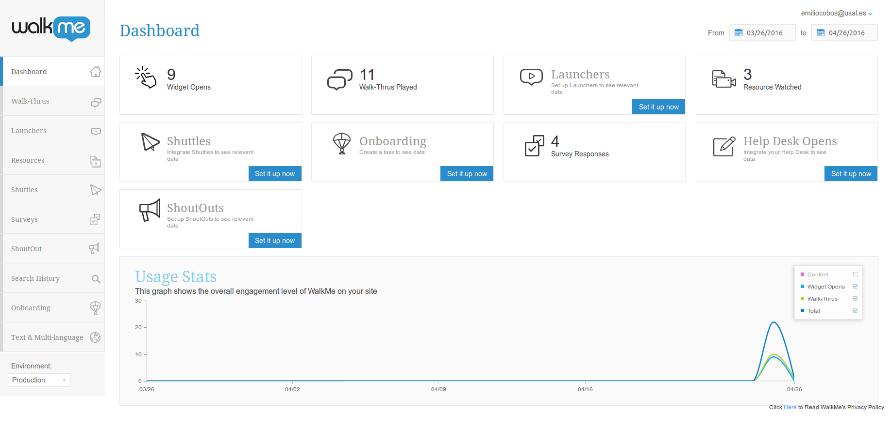
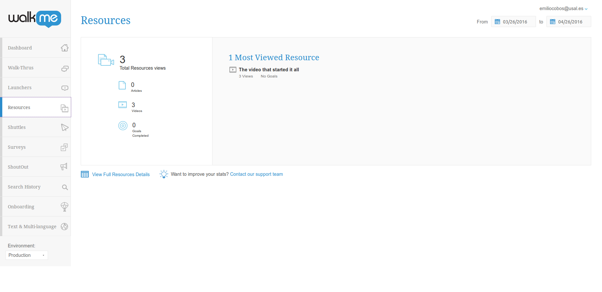
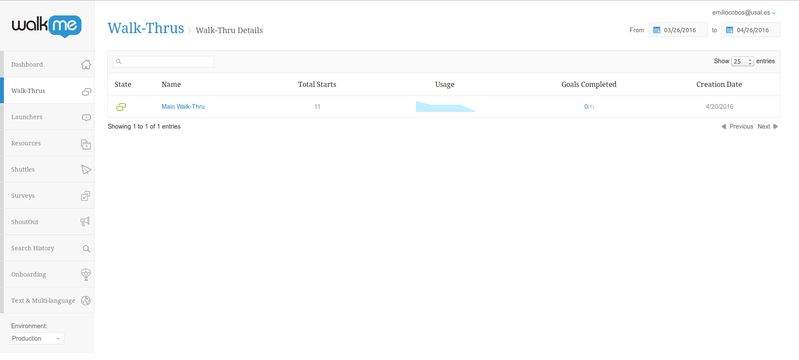
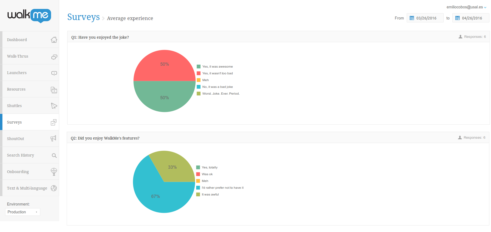

# Enunciado

Crear una cuenta en WalkMe.

En una página web creada por el alumno integrar WalkMe para guiar al usuario
y evaluar la IPO.

El WalkMe integrado debe constar como mínimo de WalkThrus , objetivos,
encuestas, más alguno de los otros elementos disponibles (uso de mínimo otro
componente más).

Una vez integrado el WalkMe en la web del alumno, se pasarán test con al menos
5 usuarios distintos (reales), de modo que en WalkMe Analytics pueda evaluarse
su desempeño y observar las diferencias entre ellos.

Se entregará vía Studium un informe que contenga la descripción de lo realizado
con WalkMe (descripción de los recursos utilizados, configuración, etc.), su
integración con la web, y los resultados arrojados por WalkMe Analytics,
incluyendo capturas de pantallas y comentarios sobre qué ha ocurrido con los
usuarios en la web.

Además, junto con el informe se entregará el código (HTML, JS, CSS, etc.) de la
web utilizada para que pueda ser probada en local (en caso de no poder,
consultar a los profesores para corregir mediante otros métodos) .

Todo lo entregado se defenderá ante los profesores en tutorías personalizadas.

# Configuración de WalkMe

La configuración de WalkMe es relativamente básica, y consiste en un Walk-Thru
que aparece automáticamente cuando el elemento principal está visible (es decir,
cuando se carga la página por primera vez), un main goal y un resource (el
vídeo).

Tras acabar el Walk-Throw, aparecerá una encuesta acerca de la experiencia
dentro de la página, con dos preguntas, una acerca de la página en sí, y otra
acerca de WalkMe.

Se adjunta una demostración de un Walk-Thru en entorno de producción (archivo
`showcase.ogv`[^video-quality]). Previamente toda la configuración se realizó en
entorno de test para evitar que los datos sean menos representativos.

[^video-quality]: Disculpas por la calidad, pero el tamaño máximo de archivo de
moodle era de 10M.

# Cambios en la interacción con la web

Durante unos días se mantuvo el walk-thru desactivado por defecto.

Hubo unas cuantas visitas a la web, y ningún usuario lo activó. Como nota tendré
que decir que la mayoría de visitas que hubo fueron de compañeros de facultad,
por lo que son gente más técnica que el usuario medio.

Curiosamente, **sólo a partir de poner el walk-thru por defecto se consiguieron
reproducciones del vídeo**. Esto puede tener múltiples interpretaciones (la más
simple es que se dieron cuenta de que el menú estaba ahí abajo).

# Datos recogidos

# Opinión de los usuarios acerca de la experiencia de WalkMe

Quitando la respuesta rellenada desde el showcase, se han conseguido otras cinco
respuestas, ninguna positiva acerca de WalkMe, y sólo dos neutrales.

Hay que tener en cuenta que probablemente todos los usuarios que respondieron
tuvieran un perfil técnico (y además les gustó el chiste, lo cual dice mucho de
ellos).

# Opinión personal sobre WalkMe

Creo que WalkMe es un servicio que tiene unos casos de uso bastante reducidos
comparado con lo que se nos quiere hacer llegar.

Mis observaciones son las siguientes:

 * WalkMe **es otro servicio más de tracking**, que los usuarios no aprecian
   demasiado, y cada vez menos.

 * Los usuarios más técnicos ven con disgusto los pop-ups intrusivos.

 * El rendimiento de una web cuenta (@web:firefox-page-load), y si bien es
 cierto que en la web de prueba es malo de por sí porque no me he tomado el
 tiempo en reducir el tamaño de las imágenes, es algo a tener en cuenta si
 tratamos de hacer una web más profesional.

## Posibles mejoras al servicio

Basándome en las observaciones hechas arriba, se me ocurren posibles mejoras al
servicio:

 * La funcionalidad de tracking debería de ser completamente opt-in (en el caso
 de existir siquiera).

 * Idealmente WalkMe debería ser cargado on-demand por el usuario.

## Posibles casos de uso

En mi opinión, dadas las observaciones hechas arriba, **el caso de uso más claro
de WalkMe es una aplicación compleja dirigida a usuarios no técnicos**.

Una aplicación demasiado simple hace que WalkMe sea completamente innecesario,
y los usuarios más técnicos prefieren una documentación más estructurada
y accesible a una guía interactiva.

# Bibliografía
