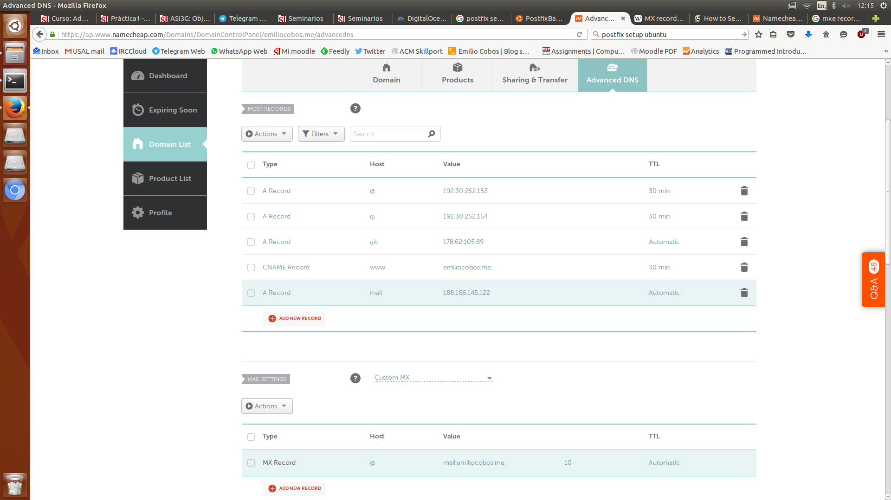

# Entorno

Se ha usado un droplet Ubuntu de [DigitalOcean](https://digitalocean.com)
recién creado para la instalación.

Para hacer la demostración y enlazarlo a un DNS normal se ha usado el dominio
`emiliocobos.me`.

Se intentará configurar el correo `ec@emiliocobos.me` como primer paso, y se
tratará de crear cuentas virtuales posteriormente.

## Setup inicial

Para hacer el setup inicial iniciaremos una sesión ssh en el droplet.

```
$ ssh root@188.166.145.122
```

Una vez dentro, instalaremos tanto `postfix` como `mailutils`:

```
# apt-get install mailutils postfix
```

Saldrá una serie de diálogos para la configuración de `postfix`.

Estos pasos se pueden realizar posteriormente usando `dpkg-reconfigure`, pero
lo configuraremos como **Internet Site**, con el nombre de dominio apropiado, en
este caso `emiliocobos.me`.


## El MX record

Tenemos que asegurarnos que hay un MX record en la configuración de DNS del
dominio, apuntando a nuestro servidor.

El MX record sólo funciona con otros nombres de dominio, así que tenemos que
crear uno con un A record.

Se ha utilizado el subdominio `mail.emiliocobos.me` como servidor de correo,
apuntando a la dirección IP de nuestro droplet.



Podemos comprobar que funciona usando los comandos `dig` y `nslookup`:

```
$ dig mx emiliocobos.me
; <<>> DiG 9.9.5-3ubuntu0.7-Ubuntu <<>> mx emiliocobos.me
;; global options: +cmd
;; Got answer:
;; ->>HEADER<<- opcode: QUERY, status: NOERROR, id: 50018
;; flags: qr rd ra; QUERY: 1, ANSWER: 1, AUTHORITY: 0, ADDITIONAL: 1

;; OPT PSEUDOSECTION:
; EDNS: version: 0, flags:; udp: 512
;; QUESTION SECTION:
;emiliocobos.me.      IN  MX

;; ANSWER SECTION:
emiliocobos.me.   1798  IN  MX  10 mail.emiliocobos.me.

;; Query time: 30 msec
;; SERVER: 8.8.8.8#53(8.8.8.8)
;; WHEN: Thu Feb 18 06:21:40 EST 2016
;; MSG SIZE  rcvd: 64
```

```
$ nslookup mail.emiliocobos.me
Server:   127.0.1.1
Address:  127.0.1.1#53

Non-authoritative answer:
Name: mail.emiliocobos.me
Address: 188.166.145.122 # <- Nuestra dirección IP
```

## Crear el usuario y asegurarse de que la configuración de postfix funciona

Desde el servidor tenemos que crear ahora el usuario `me`:

```
# useradd -m -s /bin/bash me
```

Comprobamos que `postfix` está ejecutándose:

```
# postfix status
postfix/postfix-script: the Postfix mail system is running: PID: 2504
```

Podemos enviarnos un correo conectándonos al puerto 25 localmente via `telnet`:

```
# telnet localhost 25
Trying 127.0.0.1...
Connected to localhost.
Escape character is '^]'.
220 postfix-mail-server ESMTP Postfix (Ubuntu)
ehlo localhost
250-postfix-mail-server
250-PIPELINING
250-SIZE 10240000
250-VRFY
250-ETRN
250-STARTTLS
250-ENHANCEDSTATUSCODES
250-8BITMIME
250 DSN
mail from:root@localhost
250 2.1.0 Ok
rcpt to:me@localhost
250 2.1.5 Ok
data
354 End data with <CR><LF>.<CR><LF>
Subject: Hola desde postfix!

Hey, esto es sólo una prueba.
.
250 2.0.0 Ok: queued as EAAE8120337
quit
221 2.0.0 Bye
```

Para comprobar que está, podemos entrar como `me`, y comprobar que hay correo en
`/var/mail/me`.

Usando `cat`:

```
# su -l me

me:~$ cat /var/mail/me
From root@localhost  Thu Feb 18 06:34:16 2016
Return-Path: <root@localhost>
X-Original-To: me@localhost
Delivered-To: me@localhost
Received: from localhost (localhost [127.0.0.1])
by postfix-mail-server (Postfix) with ESMTP id EAAE8120337
for <me@localhost>; Thu, 18 Feb 2016 06:31:41 -0500 (EST)
Subject: Hola desde postfix!
Message-Id: <20160218113332.EAAE8120337@postfix-mail-server>
Date: Thu, 18 Feb 2016 06:31:41 -0500 (EST)
From: root@localhost

Hey, esto es sólo una prueba.
```

Usando `mail`:

```
# su -l me
me:~$ mail
"/var/mail/me": 1 message 1 new
>N   1 root@localhost     Thu Feb 18 06:34  12/440   Hola desde postfix!
?
Return-Path: <root@localhost>
X-Original-To: me@localhost
Delivered-To: me@localhost
Received: from localhost (localhost [127.0.0.1])
by postfix-mail-server (Postfix) with ESMTP id EAAE8120337
for <me@localhost>; Thu, 18 Feb 2016 06:31:41 -0500 (EST)
Subject: Hola desde postfix!
Message-Id: <20160218113332.EAAE8120337@postfix-mail-server>
Date: Thu, 18 Feb 2016 06:31:41 -0500 (EST)
From: root@localhost

Hey, esto es sólo una prueba.
?
Saved 1 message in /home/me/mbox
Held 0 messages in /var/mail/me
```

# Instalar el servidor imap y pop

Usaremos courier como servidor IMAP y POP.

Courier usa el estilo de inbox con `Maildir`s en vez de `/var/mail`
[^maildir-note], así que es necesario configurar postfix para que funcione así:

[^maildir-note]: La ventaja de esto es que usando `Maildir` cada correo se
guarda en un archivo diferente, así que no es necesario bloquear el fichero.

```
# postconf -e "home_mailbox = Maildir/"
# postconf -e "mailbox_command = "
```

Y posteriormente instalar courier.

```
# apt-get install courier-imap courier-pop
```

# Dejar a `postfix` recibir mail desde internet

Para ello tenemos que decirle que escuche a todas las interfaces:

```
# postconf -e "inet_interfaces = all"
# postconf -e "inet_protocols = all"
```

```
# postconf -e myhostname=mail.emiliocobos.me
```

Y reiniciar `postfix`:

```
# service postfix restart
 * Stopping Postfix Mail Transport Agent postfix  [ OK ]
 * Starting Postfix Mail Transport Agent postfix  [ OK ]
```

# Mandar nuestro primer correo desde nuestro ordenador personal

Podríamos usar `telnet`, pero está bloqueado por eduroam.

Mandando un correo de ejemplo a `me@emiliocobos.me`, nos llega correctamente:

```
:~$ cat Maildir/new/1455799542.Vfd01I120a80M324168.mail.emiliocobos.me
Return-Path: <ecoal95@gmail.com>
X-Original-To: me@emiliocobos.me
Delivered-To: me@emiliocobos.me
Received: from mail-wm0-f42.google.com (mail-wm0-f42.google.com [74.125.82.42])
	by mail.emiliocobos.me (Postfix) with ESMTPS id 40E5612039F
	for <me@emiliocobos.me>; Thu, 18 Feb 2016 07:45:42 -0500 (EST)
Received: by mail-wm0-f42.google.com with SMTP id g62so25484657wme.1
        for <me@emiliocobos.me>; Thu, 18 Feb 2016 04:45:42 -0800 (PST)
DKIM-Signature: v=1; a=rsa-sha256; c=relaxed/relaxed;
        d=gmail.com; s=20120113;
        h=date:from:to:subject:message-id:mime-version:content-type
         :content-disposition:user-agent;
        bh=S7UR6xbkaf/Xs2np9nTb6dCGDntqDcAhuS9OnRaogtI=;
        b=T76BN7RY9Zczk0vg+BxZfO+G3SeCggwrjAM1QJDcMhk3gF9Bv+HVEfwOx5s66TtpR2
         cQgZznjoaBSzQ9yKilfwl1pDzHnEn0uaYVkYlKP1LQm9hghuEwtjZYFTQdfM1d84oXri
         q8PXDkRfpx1WtqHfPXqot1dFaYlErBfOrbtj18EPXCUG9lXunTyUh1tQeEhhGr5Qxpt1
         d2neEG1qLtZZscpxFDfV+bYmAAVFYT+gPsmkPV872TFq3Ldatp9BWLJQMkt28QmN8CnT
         bK4uaxPR1X8EQsubEH+OtYQ9+ir0pCPtFjCHmNcKptiAI+DbayPX/MH/dYjLXqzQsiYo
         SOXQ==
X-Google-DKIM-Signature: v=1; a=rsa-sha256; c=relaxed/relaxed;
        d=1e100.net; s=20130820;
        h=x-gm-message-state:date:from:to:subject:message-id:mime-version
         :content-type:content-disposition:user-agent;
        bh=S7UR6xbkaf/Xs2np9nTb6dCGDntqDcAhuS9OnRaogtI=;
        b=CuEOsWJ9IzlfSqCtIwiqym7vI8x2gCH7RpyD4JCZVt/yMyDe7UiAUKsmCQajktDEKO
         SxQmeQQs5vfEveM11rh8V1eoRUkXwrRZ+Nme9Yfe3mD39GXqx0AA35k2YH7lwb/tdwBz
         sQRHWcde3ANSlONnthynzEjN+xYPD9U6ygeFv/myaJDQPhJNWiRJV38P07AXiGBrR+29
         gWDE6uTpVm5/kWV4IY8/lhuftD0fY8E+gJjIZr9zahpcqEQ4Mn7Fo2w/3u+XgAyfzhru
         BlQFKGlqW0eQkq80ltZOLNT2w5T0mgjtR/5Q3H/UeCcfaUX7o10k8rYIkSGKrGUUttKm
         HGPA==
X-Gm-Message-State: AG10YOQre+VcGITp/vHxxoBHTubeIXxpbyuLq1YvRNtpYwhZXJK+Sj9JYU42qejYkRPsKw==
X-Received: by 10.28.51.74 with SMTP id z71mr3123825wmz.15.1455799542126;
        Thu, 18 Feb 2016 04:45:42 -0800 (PST)
Received: from localhost (cpdnat78.usal.es. [212.128.135.78])
        by smtp.gmail.com with ESMTPSA id ll9sm6415326wjc.29.2016.02.18.04.45.40
        for <me@emiliocobos.me>
        (version=TLS1_2 cipher=ECDHE-RSA-AES128-GCM-SHA256 bits=128/128);
        Thu, 18 Feb 2016 04:45:40 -0800 (PST)
Date: Thu, 18 Feb 2016 13:45:40 +0100
From: Emilio Cobos =?utf-8?Q?=C3=81lvarez?= <ecoal95@gmail.com>
To: me@emiliocobos.me
Subject: Hola!
Message-ID: <20160218124540.GB13119@emilio.wifi.usal.es>
MIME-Version: 1.0
Content-Type: multipart/signed; micalg=pgp-sha1;
	protocol="application/pgp-signature"; boundary="eAbsdosE1cNLO4uF"
Content-Disposition: inline
User-Agent: Mutt/1.5.24 (2015-08-30)


--eAbsdosE1cNLO4uF
Content-Type: text/plain; charset=utf-8
Content-Disposition: inline

Hola!

--eAbsdosE1cNLO4uF
Content-Type: application/pgp-signature; name="signature.asc"

-----BEGIN PGP SIGNATURE-----
Version: GnuPG v1

iQEcBAEBAgAGBQJWxbz0AAoJEAVrcnu5wQJ81PsH+gKoaQkzZwiahxsDQOXlX24W
rBzvrmhaWT26TI8FGYwhSnK6mw9MRYYpA3zCSKA1RdHs5LO0hbnmU57yfGf7oFqx
c6FFbl6/xMbMeX1TjMrupatqn62KXb+HvPb2UZHvz5o+vOAWRlWeO/fv8eYXglqE
cZeGOo1qdx/aCfTUOa8aggM50BTs7b6Z9P5lWYRg47FUvHupRqpyC4oODa7OFgrZ
0aYvjYEsX66zP/jB/YXq8Qd+jspig2f2L2g/cWqPw5QEqSKh7bXRIetTH8o1Nnue
qlXD2gRNJQrL2xyZuA7wYcjMki41s9/8awY5fVZGIRbrgRIkN3Zy+2mG0VRGNF4=
=vvfn
-----END PGP SIGNATURE-----

--eAbsdosE1cNLO4uF--
```

# Configurando imap con mutt

Asignaremos una contraseña a nuestro usuario `me`:

```
# passwd me
```

Y configuraremos `mutt` tal que así:

```
set from = "me@emiliocobos.me"
set sendmail="/usr/bin/msmtp -v -a personal"

set folder      = imap://mail.emiliocobos.me/
set imap_user   = me
set imap_pass   = xxx
set spoolfile   = +INBOX

mailboxes       = +INBOX

set mbox = +INBOX.All
set postponed = +INBOX.Drafts
set record = +INBOX.Sent
```

**Ahora podemos enviar y recibir mails desde nuestro propio correo!**

# Forzando TLS y SASL

Uno de los problemas que tenemos actualmente es que puede que nuestros datos
vayan **en texto plano** directamente al servidor.

Esto es un problema muy serio de seguridad, así que vamos a forzar el uso de SSL
o TLS para conectarnos a nuestro servidor.

Para ello deberíamos usar un certificado creado por nosotros mismos.

```
# openssl req -sha256 -x509 -newkey rsa:2048 \
  -keyout key.pem -out cert.pem -days 365 -nodes
```

Este comando genera un certificado y una clave válidos para 365 días.

Pero... por suerte **en los SO basados en Debian ya existe un certificado y una
clave a tal efecto**: `ssl-cert-snakeoil.pem`.

Estas opciones deberían estar ya configuradas en postfix, pero si no lo
estuvieran, o quisieras cambiar el certificado, podrías poner las opciones:

```
smtpd_tls_cert_file=/etc/ssl/certs/ssl-cert-snakeoil.pem
smtpd_tls_key_file=/etc/ssl/private/ssl-cert-snakeoil.key
```

## Forzando TLS cons SASL en postfix

Para permitir mandar correo via TLS usaremos:

```
# postconf -e "smtpd_tls_auth_only=yes"
# postconf -e "smtpd_tls_security_level=encrypt"
```

Pero ahora nuestro servidor no soporta ningún modo de autenticación, así
que tenemos que activar **SASL**:

```
# postconf -e "smtpd_sasl_auth_enable=yes"
# postconf -e "smtpd_sasl_tls_security_options=noanonymous"
```

Si sois curiosos y queréis saber lo que es SASL, significa *Simple
Authentication Security Layer*. Mi conocimiento no pasa de ahí, está explicado
en el [RFC 2222](http://ftp.ietf.org/rfc/rfc2222.txt), que no me he leído.

No obstante, citando a [la documentación de
`cyrus`](http://www.sendmail.org/~ca/email/cyrus2/programming.html#what_is_sasl):

> That document is very difficult to understand however and it should be
unnecessary to consult it.

El caso es que para soportar SASL, hay que usar una de las librerías que proveen
este sistema (`cyrus` o `dovecot`).

Usaremos `cyrus`, para lo que seguiremos [esta guía de
Debian](https://wiki.debian.org/PostfixAndSASL#SASL_authentication_in_the_Postfix_SMTP_server).

Instalaremos `libsasl2`:

```
# apt-get install libsasl2-modules sasl2-bin
```

Crearemos `/etc/postfix/sasl/smtpd.conf`, con los contenidos:

```
pwcheck_method: saslauthd
mech_list: PLAIN LOGIN
```

Y seguimos con la guía. En resumen, tenemos que crear un daemon nuevo para
postfix ya que se ejecuta con `chroot` en Debian.

```
# cp /etc/default/saslauthd /etc/default/saslauthd-postfix
# # Editarlo (ver la guía)
# dpkg-statoverride --add root sasl 710 /var/spool/postfix/var/run/saslauthd
# adduser postfix sasl
# postconf -e 'smtpd_sasl_local_domain = $myhostname'
# postconf -e 'smtpd_sasl_auth_enable = yes'
# postconf -e 'broken_sasl_auth_clients = yes'
# postconf -e 'smtpd_sasl_security_options = noanonymous'
# postconf -e 'smtpd_recipient_restrictions = permit_sasl_authenticated, \
permit_mynetworks, reject_unauth_destination'
# saslfinger -s
# service postfix restart
```

Y listo! **Ya podemos loguearnos correctamente otra vez!**

## Aceptar el certificado

Ahora mismo, al intentar mandar un e-mail, el cliente de correo no lo envía
porque no confía en el certificado mandado por el servidor (ya que no está
firmado por ninguna autoridad).

Para solucionar esto, tenemos que decirle a nuestro cliente que "confíe" en ese
certificado.

Para hacerlo con `msmtp`, podremos hacer:

```
# openssl x509 -fingerprint -in /etc/ssl/certs/ssl-cert-snakeoil.pem
SHA1 Fingerprint=xxxxx
```

Copiando ese fingerprint en `.msmtprc`, con la línea:

```
tls_fingerprint "xxxx"
```

Comprobará el fingerprint del certificado cuando se conecte.

# Usar SSL en el servidor IMAP

Para usar SSL en el servidor imap, deberemos instalar el paquete
`courier-imap-ssl`.

```
# apt-get install courier-imap-ssl
```

Esto generará un certificado en `/usr/lib/courier/imapd.pem`, pero nosotros, por
comodidad, usaremos el mismo que para `smtpd`, es decir: `ssl-cert-snakeoil`.

Courier imap usa un formato un poco diferente, así que tenemos que concatenar el
certificado y la clave.

```
# cat /etc/ssl/certs/ssl-cert-snakeoil.pem \
      /etc/ssl/private/ssl-cert-snakeoil.key \
      > /etc/courier/ssl-cert-snakeoil.pem
```

Hay que editar la variable `TLS_CERTFILE` del archivo `/etc/courier/imapd-ssl`
para apuntar a este nuevo archivo.

Tras eso reiniciaremos `courier-imap`:

```
/etc/init.d/courier-imap-ssl restart
```

# Extras

## Direcciones virtuales

Especificar direcciones virtuales es extremadamente simple, sólo hay que alterar
el archivo de aliases: `/etc/aliases`.

Puedes camiarlo a uno específico de postfix de todas formas con las claves de
configuración `alias_maps` y `alias_database`.

Por ejemplo, supongamos que queremos que `admin@emiliocobos.me`
vaya a `me@emiliocobos.me`:

```
# echo "admin: me" >> /etc/aliases
# newaliases
```

## Cliente web

Se puede acceder al correo con cualquier cliente, llámese `mutt`, `thunderbird`,
Outlook, etc...

Pero vivimos en un mundo en el que si no puedes tener acceso siempre al correo
no eres nadie, así que vamos a añadir rápidamente `roundcube` como ejemplo.

Para eso necesitaremos un servidor web (`apache2` funciona bien, y se configura
automáticamente), y `mysql`.

```
# apt-get install apache2 mysql-client-5.6 mysql-server-5.6
# mysql_secure_installation
# apt-get install roundcube roundcube-mysql aspell-es
```

Resulta que la instalación de mysql falla porque nuestro servidor es demasiado
pequeño, así que usaremos `postgresql`, que esperemos que se porte mejor con
nuestra memoria.

```
# apt-get install apache2 postgresql
# pg_createcluster 9.3 main --start
# apt-get install roundcube roundcube-pgsql aspell-es
```

Como no tenemos hosts virtuales, activaremos roundcube en el directorio
principal, descomentando las siguientes líneas del archivo
`/etc/apache2/conf-enabled/roundcube.conf`:

```
Alias /roundcube/program/js/tiny_mce/ /usr/share/tinymce/www/
Alias /roundcube /var/lib/roundcube
```

Posteriormente:

```
# service apache2 restart
```

Deberíamos de ser capaces de ver roundcube en el directorio `/roundcube` de
nuestro servidor:


Ahora sólo tenemos que instalar la base de datos, para eso usaremos el comando
`createuser` de postgresql, que con la opción `-d` también crea una BBDD con los
permisos adecuados.

```
# su -l postgres
postgres:~$ createuser -d -W roundcube
Password:
```

Finalmente usamos:

```
# dpkg-reconfigure roundcube-core
```

Que nos guiará a lo largo del resto de la instalación.

Si aún así tenéis problemas al entrar, mirad `/var/lib/roundcube/logs/errors`,
comprobad que la configuración de la base de datos es correcta, y que el módulo
`mcrypt` de PHP está instalado.

Si no lo estuviera, podríais hacer:

```
# php5enmod mcrypt
# service apache2 restart
```

## El SPF record

El record SPF (*Sender Policy Framework*) es un DNS record del tipo TXT que
indica o puede indicar, entre otras cosas, la dirección IP de tu servidor de
correo.

Usarlo ayuda, por ejemplo, a que clientes de correo muy utilizados no marquen tu
correo como spam, y a que marquen como spam el email de gente que te está
tratando de impersonar.

La [sintaxis detallada](http://www.openspf.org/SPF_Record_Syntax) es
relativamente compleja, pero un buen intento puede ser el siguiente:

```
v=spf1 a mx -all
```

o (más estricto):

```
v=spf1 a mx ip4:188.166.145.122 -all
```

Otras técnicas más sofisticadas (como `DMARK`, que combina `DKIM` y `SPF`),
existen, pero el autor no se siente con la suficiente confianza como para hablar
de ellas.
